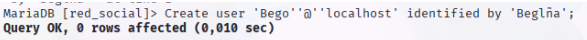
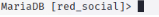
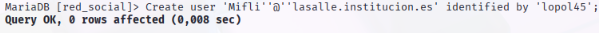

# MYSQL

## Creación de Tablas
### Tabla Usuario

 
### Tabla Grupo

### Tabla Comentario

## Cambios en la BBDD

### 1 Indica el nombre de las tablas que aparecen en tu base de datos mysql.

### 2 Crea el usuario "Bego" con contraseña "Beglña" para que pueda acceder desde localhost

### 3 Crea el usuario "Mati" con contraseña "aMti90" para que pueda acceder desde el dominio [lasalleinstitucion.es](http://lasalleinstitucion.es).

### 4 Crea el usuario "Mifli" con contraseña "lopol45" para que pueda acceder desde el dominio [lasalleinstitucion.es](http://lasalleinstitucion.es).
 
### 5 Muestra los usuarios creados (los que están en la tabla user de la base de datos mysql). Indica la sentencia que has utilizado para mostrar esos usuarios.

### 6 Muestra el usuario con el que te has logado, utilizando para ello una función. Indica la sentencia que has utilizado para ello.

### 7 Cambia la contraseña de Mati, de manera que la nueva contraseña sea "minuevacontraseña". Indica la sentencia que has utilizado para ello.

### 8 Muestra los privilegios del usuario Bego. Indica la sentencia que has utilizado para ello. 9. Muestra los privilegios del usuario con el que te has logado. Indica la sentencia que has utilizado para ello.

### 9 Concede permisos al usuario Bego de lectura y actualización sobre la tabla usuario. 11. Conéctate como Bego y lanza una sentencia select y otra update sobre la tabla usuario. Lanza también una sentencia delete. Muestra las sentencias y sus efectos sobre la base de datos de la red social.
### 10 Concede permisos al usuario Mati de borrado sobre la tabla grupo. 
### 11 Crea el usuario Crispula con contraseña "rosita" para que pueda acceder desde el dominio [lasalleinstitucion.es](http://lasalleinstitucion.es) y con permiso de lectura, actualización y borrado sobre las tablas usuario, grupo y comentario. Concede además permisos a Crispula para que pueda conceder sus permisos a otros usuarios.
### 12 Conéctate con el usuario Crispula.
### 13 Inserta un registro en la tabla comentario. Actualiza un registro de la tabla grupo. Muestra las sentencias y su resultado al ejecutarlas sobre la base de datos de la red social.
### 14 Concede permiso de borrado sobre la tabla usuario a Bego. Muestra la sentencia utilizada y el resultado de su ejecución.
### 15 Concede permiso de lectura y actualización sobre la tabla grupo a Mati. Muestra la sentencia utilizada y el resultado de su ejecución.

### 16 Vuelve a conectarte con tu usuario de mysql.

### 17 Concede permisos totales sobre todas las tablas de la base de datos de la red social a Mifli. Muestra la sentencia utilizada y el resultado de su ejecución.

### 18 Quítale permisos de borrado sobre todas las tablas de la base de datos de la red social a Mifli. Muestra la sentencia utilizada y el resultado de su ejecución.

### 19 Muestra los usuarios creados y sus privilegios (los que están en la tabla user de la base de datos mysql). Indica la sentencia que has utilizado para mostrar esos usuarios. 

### 20 Cambia la contraseña del usuario Mifli modificando directamente la tabla user. Indica la sentencia que has utilizado para ello.

### 21 ¿Has necesita hacer FLUSH PRIVILEGES después de la sentencia anterior? Explica el porqué y para qué sirve FLUSH PRIVILEGES.

### 22 ¿Puedo utilizar la función PASSWORD con GRANT? Justifica tu respuesta.

### 23 Elimina el usuario Mifli. Muestra la sentencia utilizada y el resultado de su ejecución.
