# Gestión y Configuración de Bases de Datos SQLite

Requisitos del entorno:

1. Instalación de SQLite3: Asegúrate de tener SQLite instalado en tu entorno de trabajo. Puedes verificarlo con sqlite3 -version.
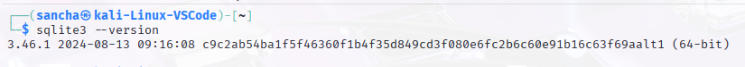
2. Crea una base de datos llamada frutas.db que almacenará la información de mandarinas, melocotones y caquis.

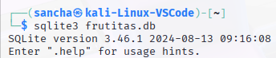

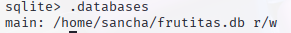
# 1. Configuración de la base de datos (2 puntos)

## 1.1. Creación de tablas y estructura

Crea las siguientes tablas básicas con las restricciones adecuadas:

Mandarinas:

id_mandarina (INTEGER, PK, AUTOINCREMENT): Identificador único para cada mandarina.

tipo (TEXT, NOT NULL): Color o tipo de mandarina.

origen (TEXT, NOT NULL): Tipo de mandarina.

tamano (TEXT, NOT NULL): Tamaño de la mandarina.

fecha_recogida (TEXT, NOT NULL): Fecha en la que se recogió la mandarina.

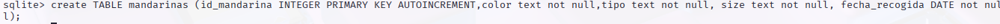
Melocotones:

id_melocoton (INTEGER, PK, AUTOINCREMENT): Identificador único para cada melocotón.

tipo (TEXT, NOT NULL): Tipo de melocotón.

indicemadurez (BOOLEAN, NOT NULL): Indica si el melocotón es suave (1) o no (0).

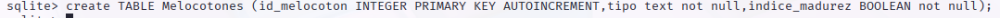

Caquis:

id_caqui (INTEGER, PK, AUTOINCREMENT): Identificador único para cada caqui.

id_mandarina (INTEGER, FK, NOT NULL): Relacionado con id_mandarina en la tabla Mandarinas.

id_melocoton (INTEGER, FK, NOT NULL): Relacionado con id_melocoton en la tabla Melocotones.


```SQL
CREATE TABLE Caquis(
    id caqui INTEGER NOT NULL,
    color text not null,
    pedunculo boolean NOT NULL,
    timepo_maduracion INTEGER not null,
    id_mandarinas INTEGER not null, 
    id_melocoton INTEGER not null,
    FOREIGN KEY (id_mandarinas) REFERENCES mandarinas (id_mandarina),
    FOREIGN KEY (id_melocoton )
    REFERENCES Melocotones (id_melocoton));  
```
tipo (TEXT, NOT NULL): Tipo de caqui.

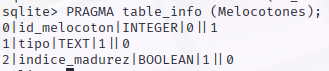

es_premium (BOOLEAN, NOT NULL): Indica si el caqui tiene profundidad (1) o no (0).

tiempo_maduracion (INTEGER, NOT NULL): Tiempo de maduración en días.

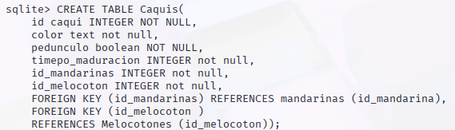
## 1.2. Tamaño y más...

Justifica cuánto ocupa tu base de datos en disco. ¿En qué momento aumenta de tamaño? Si se mete más info, ¿cómo DBA harías algo para optimizar esto?

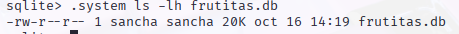

# 2. Optimización del rendimiento y mantenimiento (5 puntos)

Se ha encontrado un trozo de las consultas a la base de datos durante el día 27 de octubre de 2024. Se pide qué optimizaciones realizarías y por qué para mejorar la base de datos en función de la información que te ofrece el log y justifícalo.

Se puede proponer en base a todas las búsquedas realizadas, ver cuales son más frecuentes y hacer un índice exclusivo sobre esas búsquedas. Para ello, crea índices complejos que sirvan para una búsqueda de datos más precisa.

Sqlite tiene una opción con explain query plan como "scan table" que escanea la tabla y si las tablas no tienen índices que permitan buscar datos de forma más exacta, se puede implementar.

# 3. Copias de seguridad y restauración (2.5 puntos)

## 3.1. Realización de una copia de seguridad con el nombre frutas_bonitas_bonitas.db.


## 3.2. Realiza la restauración desde la copia de seguridad

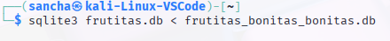

## 3.3. Automatización de backups

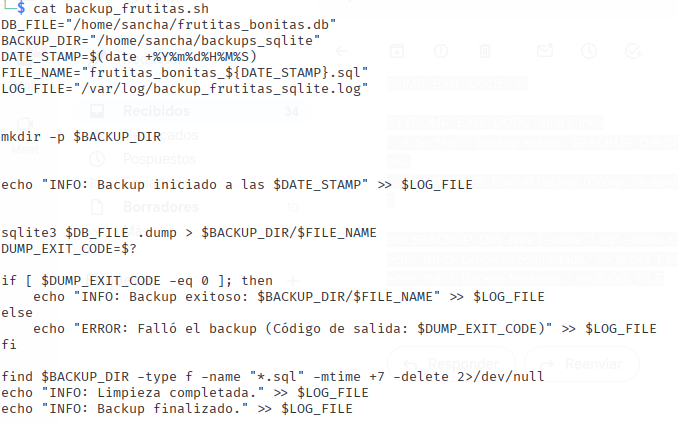
Crea un script para backups automáticos y que ejecute todos los días a las 23:59:59.

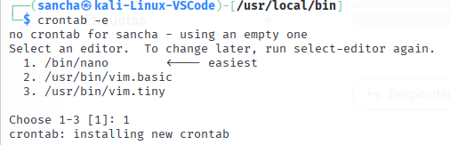
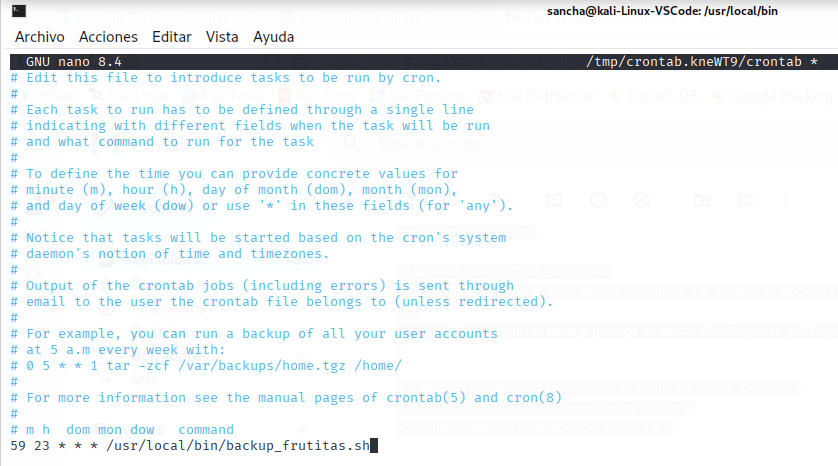


## 4. Preguntas sin Chatgpt ni IA: (0.5 puntos)

¿Cómo impactan los cambios en el PRAGMA en el rendimiento y la seguridad de la base de datos?

El pragma es el conjunto de ajustes de la bbdd, si se fuerzan a algunos cambios , como activar el modo síncrono obliga a sqlite a confirmar los cambios, ralentiza el rendimiento pero evita la pérdida de datos.

¿Qué herramientas usarías para proteger una base de datos SQLite en un entorno de producción?

En primer lugar utilizaría un algoritmo para codificar los datos como puede ser AES y ejecutaría un script todos los días backups incrementales y un backup full una vez a la semana, para evitar que se pierdan los datos o si entran y borran los datos, poder restaurarlos.

¿Que diferencia existe entre los modos de journaling como "delete" "truncate" "wal" en sqlite?

En primer lugar, delete borra el dato, especificando con la condicion where, pero no borra todos los datos de la tabla, cosa que si hace la función de truncate. Mientras que WAl, funciona copiando el contenido original de la base de datos, sin modificaciones, en un archivo separado y, a continuación, escribiendo los cambios directamente en dicho archivo.
