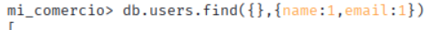
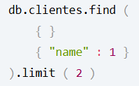
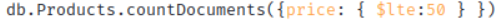
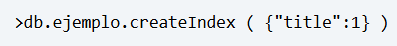
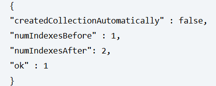
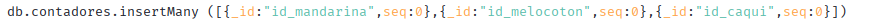
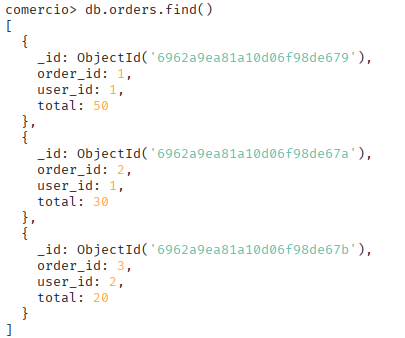
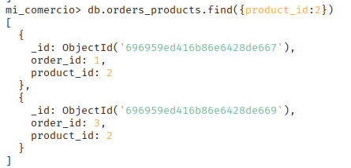

# 1.Explica para MongoDB los siguientes puntos:
## 1.Modelo de datos basado en documentos

Una base de datos orientada a documentos almacena datos en documentos similares a los objetos JSON (JavaScript Object Notation). Cada documento contiene pares de campos y valores. Por lo general, los valores pueden ser de una variedad de tipos, entre ellos, strings, números, operadores booleanos, arreglos o, incluso, otros objetos. 

## 2.NoSQL

Significa que en lugar de guardar los datos en tablas como se hace en las bases de datos relacionales, MongoDB guarda estructuras de datos en documentos tipo JSON. 

## 3.Escalabilidad horizontal

Implica añadir más máquinas para distribuir mejor la carga de la base de datos y aumentar la capacidad general de almacenamiento o procesamiento. Existen dos métodos comunes para realizar el escalamiento horizontal: la fragmentación, que aumenta la capacidad general del sistema, y ​​la replicación, que aumenta la disponibilidad y la fiabilidad del sistema.

## 4.Consultas

La aplicación permite hacer búsquedas de un sólo campo o varios, como puede ser:

Además, permite limitar la búsquedad de resultados:

O para buscar por cantidades si son mayores o menores, como:

## 5.Alta disponibilidad

Es la capacidad de que la base de datos permanezca accesible y funcional casi el 100% del tiempo, incluso ante fallos de hardware o mantenimiento, lograda principalmente mediante Conjuntos de Réplicas (Replica Sets), que son grupos de servidores que replican datos para crear redundancia y habilitan la conmutación por error automática si el nodo principal falla, asegurando continuidad operativa y protección contra pérdida de datos. 

## 6.Índices

MongoDB permite crear índices, para optimizar las búsquedas de información, como este ejemplo:

El resultado es el siguieten:

La primera línea indica que la colección fue creada manualmente con MongoDB create collection. La segunda línea muestra cuántos índices hay antes de que se ejecute el comando. La tercera línea muestra el número de índices después del comando, y la cuarta línea indica el éxito de la operación.

## 7.Agregaciones

La agregación consiste en reunir datos existentes de múltiples fuentes y expresarlos en una forma nueva y resumida, ya sea una suma o un recuento.

## 8.Resumen con tus palabras de lo que te parece más interesante
     
De todos los parámetros, el que más me ha llamado la atención es el de la escalabilidad horizonta, puesto que en lugar de darle más recursos aun servidor, añadiendo más servidores permite guardar más información, no tener dependencia sólo sobre un servidor y si se hace raid 1, otros servidores contienen la información en caso de que falle uno.

# 2. Esquema de la Base de Datos Relacional de mandarinas

## 1. Creamos la base de datos Mandarinas

Para poder hacer que los valores id sean Autoincrement, tuve que crear una tabla con los id y función con javascript.

La parte de find and modify query es que mientras se asigna el numero se para el resto de operacion y no se asignes dos ID iguales, el query  para que busque el id, update lo actualiza y le suma +1 y el new:true es para que devuelva la bbdd actualizada y si es false, lo devuelve sin actualizar.

Si quisieras empezar a contar desde otro número, simplemente en la imagen que muestro en el id que te interesa, cambias el 0 por el número al que quieres empezar a contar.

- Mandarinas:id_mandarina (INTEGER, PK, AUTOINCREMENT),color (TEXT, NOT NULL),tipo (TEXT, NOT NULL)
size (TEXT, NOT NULL),fecha_recogida (DATE, NOT NULL)

- Melocotones: id_melocoton (INTEGER, PK, AUTOINCREMENT),tipo (TEXT, NOT NULL),
suavidad (BOOLEAN, NOT NULL)

- Caquis:id_caqui (INTEGER, PK, AUTOINCREMENT),id_mandarina (INTEGER, FK, NOT NULL),id_melocoton (INTEGER, FK, NOT NULL),color (TEXT, NOT NULL)
pedunculo (BOOLEAN, NOT NULL),tiempo_maduracion (INTEGER, NOT NULL)

- Total de tablas:

# 2.Esquema de la Base de Datos Relacional de un comercio

La base de datos relacional consta de las siguientes tablas:

- Tabla users:user_id (PRIMARY KEY),name (TEXT),email (TEXT)

- Tabla orders:order_id (PRIMARY KEY),user_id (FOREIGN KEY),total (REAL)

- Tabla products:product_id (PRIMARY KEY),name (TEXT),price (REAL)

- Tabla intermedia order_products:order_id (FOREIGN KEY),product_id (FOREIGN KEY)

# 2. Creación de la Base de Datos y Inserción de Datos

## 1. Utilizando la Terminal de mongo, crea una base de datos llamada mi_comercio

### Tabla Mandarinas:

### Tabla Melocotones:

### Tabla caquis:

### Tabla users:

### Tabla Products:

### Tabla Orders:

### Tabla Orders_Products:

## 2. Realiza las siguientes consultas:

### 0: Lista todas la colecciones

### 1: Listar todos los usuarios

### 2: Buscar pedidos de un usuario cuyo id sea 1

### 3: Listar productos con precio mayor a 30

### 4: Buscar pedidos que contengan un producto con id = 2

### 5: Obtener usuarios que hayan realizado pedidos con un total mayor a 40

 
### 6: Mostrar solo los nombres y correos de los usuarios

### 7: Contar cuántos productos tienen un precio menor o igual a 50

### 8: Encontrar usuarios que hayan pedido un producto llamado "Mouse"

### 9: Agrupar los pedidos por usuario y calcular el total gastado por cada uno

### 10: Listar productos únicos comprados en todos los pedidos

## 2. Realiza lo mismo desde la interfaz gráfica MongoDB Compass creando una base de datos llamada mi_comercio2

Para crear las tablas de forma gráfica, desde la BBDD de mandarinas y de comercio permite exportar sus tablas en formato de JSON, de esta forma, al crear la BBDD de micomercio_2, deja importar las tablas que se han exportado anteriormente. 

Por otro lado, para el tema de los filtros, existe una terminal en la plataforma, por lo que he utilizado los mismos filtros para hacer las búsquedas.

### 0: Lista todas la colecciones

### 1: Listar todos los usuarios

### 2: Buscar pedidos de un usuario cuyo id sea 1

### 3: Listar productos con precio mayor a 30

### 4: Buscar pedidos que contengan un producto con id = 2

### 5: Obtener usuarios que hayan realizado pedidos con un total mayor a 40

### 6: Mostrar solo los nombres y correos de los usuarios

### 7: Contar cuántos productos tienen un precio menor o igual a 50

### 8: Encontrar usuarios que hayan pedido un producto llamado "Mouse"

### 9: Agrupar los pedidos por usuario y calcular el total gastado por cada uno

### 10: Listar productos únicos comprados en todos los pedidos

# 3. Reflexión sobre las diferencias entre trabajar con MongoDB desde la terminal y desde Compass, destacando ventajas y desventajas de cada método.

Después de haber trabajado con ambas opciones, he ahorrado tiempo de la forma gráfica puesto que ya estaban hechas las tablas desde el terminal y sólo he tenido que importarlas. No obstante, después de estar navegando por la aplicación no encontré ninguna otra forma de subir las tablas que no fuera a comando, por lo que en ese aspecto, prefiero el terminal.

Y a la hora de filtrar, también había que hacerlo a comando porque no hay otra forma y tienes que saber los filtros, por lo que en mi opinión no ofrece ninguna ventaja en cuanto al ahorro de tiempo para hacer los filtros.

Mi conclusión final es que no he notado ninguna ventaja a la hora de utilizar el MongoDB Compass con respecto al terminal, por lo que me parece más útil el terminal, no me ha dado problemas y para utilizar el método gráfico, necesitas habilitar el docker, por lo que tienes que usar terminal igualmente.

## 4. Bibliografía

- https://www.purestorage.com/es/knowledge/what-is-mongodb.html[Modelo_de_datos_basado_en_documentos]
- https://mappinggis.com/2014/07/mongodb-y-gis/#:~:text=Vamos%20a%20empezar%20por%20el,de%20un%20JSON%20como%20almacenamiento.&text=%C2%BFC%C3%B3mo%20se%20realiza%20una%20consulta,%C2%BFQui%C3%A9n%20usa%20MongoDB?[NoSQL]
- https://www.mongodb.com/resources/basics/horizontal-vs-vertical-scaling[Escalabilidad_Horizontal]
- https://www.ionos.es/digitalguide/paginas-web/desarrollo-web/mongodb-queries/[Búsquedas]
- https://www.mongodb.com/resources/basics/high-availability[Alta_Disponibilidad]
- https://www.ionos.es/digitalguide/paginas-web/desarrollo-web/mongodb-create-index/[Índices]
- https://studio3t.com/es/mongodb-tools/aggregation-editor/#:~:text=La%20agregaci%C3%B3n%20consiste%20en%20reunir,una%20suma%20o%20un%20recuento.[Agregaciones]

  