# 1. Instala en Docker la última versión Mongo DB oficial.

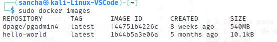
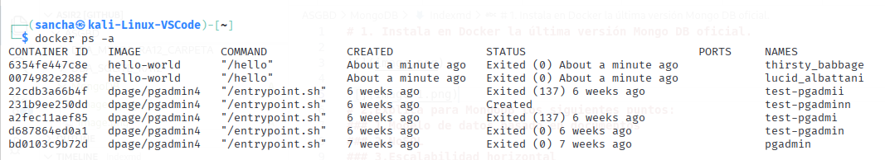
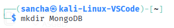

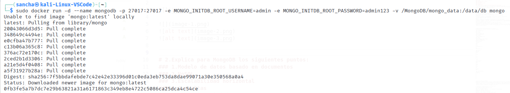

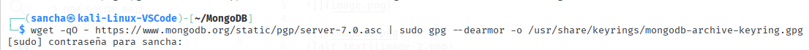 

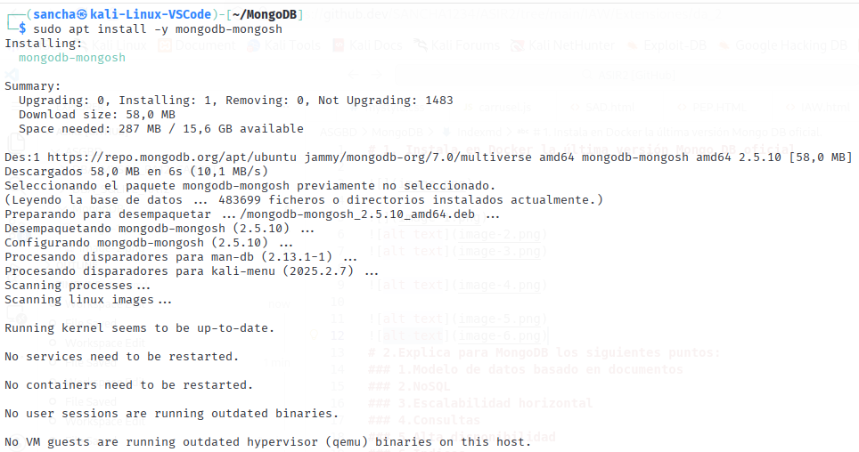
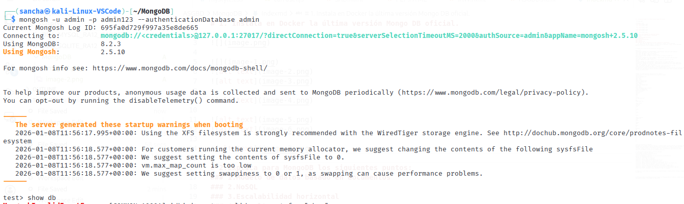
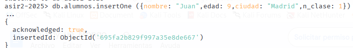
# 2.Explica para MongoDB los siguientes puntos:
### 1.Modelo de datos basado en documentos
https://www.purestorage.com/es/knowledge/what-is-mongodb.html

### 2.NoSQL
https://www.mongodb.com/es/resources/basics/databases/nosql-explained
### 3.Escalabilidad horizontal
https://lambdaloopers.com/blog/como-escalar-y-optimizar-una-base-de-datos-en-mongodb/
### 4.Consultas
### 5.Alta disponibilidad
### 6.Índices
### 7.Agregaciones
### 8.Resumen con tus palabras de lo que te parece más interesante
     3)  Haz commit en cada clase con el comentario: [clase] 'tarea realizada'
Lo que trabajes en casa haz commit al terminar con el comentario: [casa] 'tarea realizada'
Rellena el portfolio con tu feedback del desafío.

0) Esquema de la Base de Datos Relacional de mandarinas

## 1. Creamos la base de datos Mandarinas

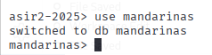
Mandarinas:
id_mandarina (INTEGER, PK, AUTOINCREMENT): Identificador único para cada mandarina.
color (TEXT, NOT NULL): Color de la mandarina.
tipo (TEXT, NOT NULL): Tipo de mandarina.
size (TEXT, NOT NULL): Tamaño de la mandarina.
fecha_recogida (DATE, NOT NULL): Fecha en la que se recogió la mandarina.

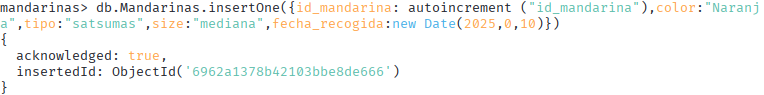

Melocotones:
id_melocoton (INTEGER, PK, AUTOINCREMENT): Identificador único para cada melocotón.
tipo (TEXT, NOT NULL): Tipo de melocotón.
suavidad (BOOLEAN, NOT NULL): Indica si el melocotón es suave (1) o no (0).

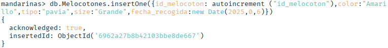
Caquis:
id_caqui (INTEGER, PK, AUTOINCREMENT): Identificador único para cada caqui.
id_mandarina (INTEGER, FK, NOT NULL): Relacionado con id_mandarina en la tabla mandarinas.
id_melocoton (INTEGER, FK, NOT NULL): Relacionado con id_melocoton en la tabla melocotones.
color (TEXT, NOT NULL): Color del caqui.
pedunculo (BOOLEAN, NOT NULL): Indica si el caqui tiene pedúnculo (1) o no (0).
tiempo_maduracion (INTEGER, NOT NULL): Tiempo de maduración en días.

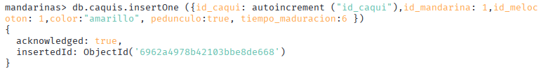

Total de tablas:

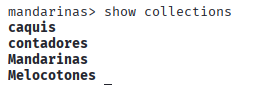

# 2.Esquema de la Base de Datos Relacional de un comercio
La base de datos relacional consta de las siguientes tablas:

Tabla users
user_id (PRIMARY KEY)
name (TEXT)
email (TEXT)

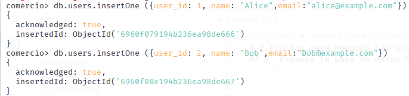

Tabla orders
order_id (PRIMARY KEY)
user_id (FOREIGN KEY)
total (REAL)

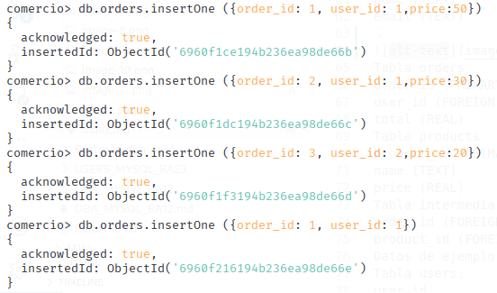

Tabla products
product_id (PRIMARY KEY)
name (TEXT)
price (REAL)

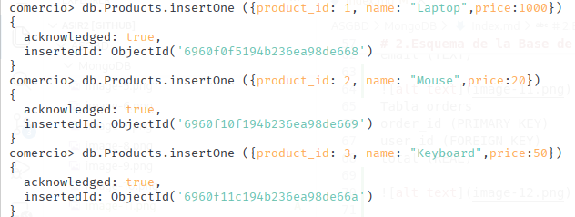

Tabla intermedia order_products
order_id (FOREIGN KEY)
product_id (FOREIGN KEY)

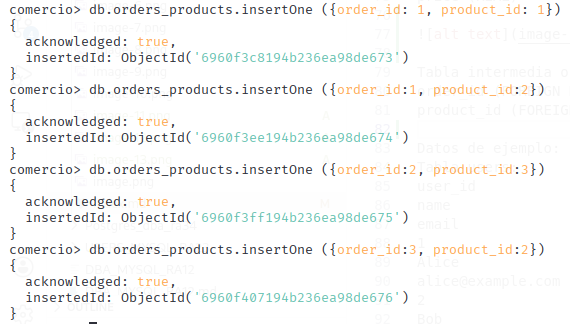

Datos de ejemplo:
Tabla users:

user_id name email 
1 Alice alice@example.com

2 Bob bob@example.com

Tabla orders:
order_id
user_id
total
1
1
50.00
2
1
30.00
3
2
20.00

Tabla products:
product_id
name
price
1
Laptop
1000
2
Mouse
20
3
Keyboard
50

Tabla order_products:
order_id
product_id
1
1
1
2
2
3
3
2

Diseño de Documentos en MongoDB
Basándose en el esquema relacional anterior, se debe diseñar la estructura de los documentos en MongoDB para cada colección que se considere necesaria para cubrir todos los datos que pueda albergar la base de datos. Y teniendo en cuenta las relaciones y la  optimización de las consultas. Después de diseñar las colecciones, crear los documentos específicos para poder insertar exactamente los datos de los ejemplos anteriores.

Tabla Mandarinas:

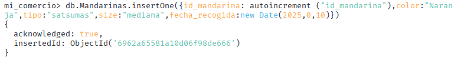

Tabla Melocotones:

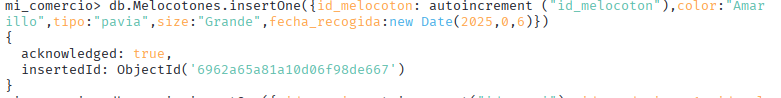

Tabla caquis:

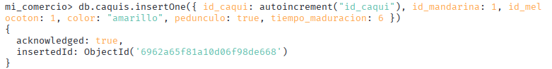

Tabla users:

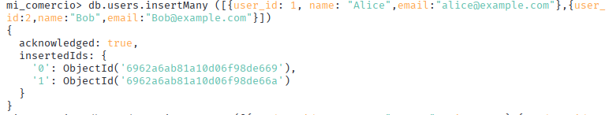

Tabla Products:

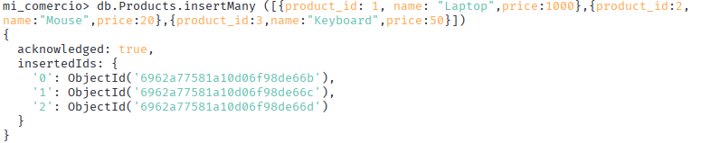

Tabla Orders:

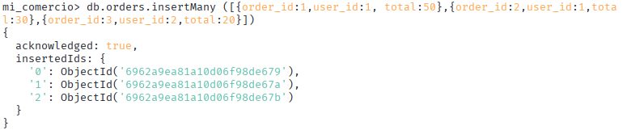

Tabla Orders_Products:

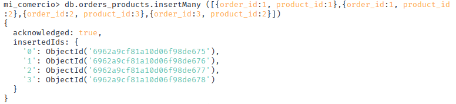

2) Creación de la Base de Datos y Inserción de Datos
A. Utilizando la Terminal de mongo
Crea una base de datos llamada mi_comercio
Crea las colecciones anteriores
Inserta los documentos anteriores en las colecciones correspondientes.
Realiza las siguientes consultas:
### 0: Lista todas la colecciones

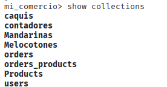

### 1: Listar todos los usuarios

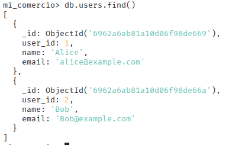

### 2: Buscar pedidos de un usuario cuyo id sea 1

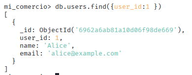

### 3: Listar productos con precio mayor a 30

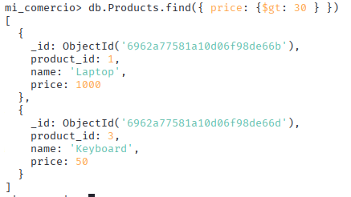
### 4: Buscar pedidos que contengan un producto con id = 2

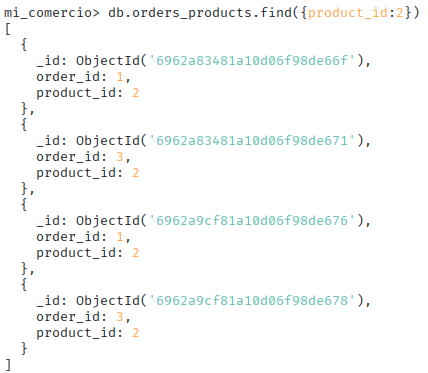

### 5: Obtener usuarios que hayan realizado pedidos con un total mayor a 40

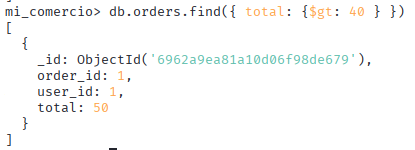 
### 6: Mostrar solo los nombres y correos de los usuarios

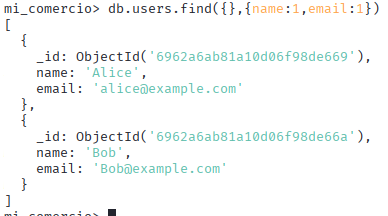

### 7: Contar cuántos productos tienen un precio menor o igual a 50

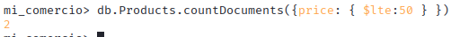

### 8: Encontrar usuarios que hayan pedido un producto llamado "Mouse"

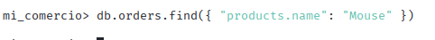

### 9: Agrupar los pedidos por usuario y calcular el total gastado por cada uno

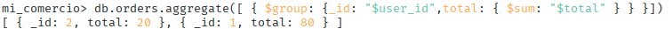

### 10: Listar productos únicos comprados en todos los pedidos

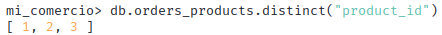

B. Realiza lo mismo desde la interfaz gráfica MongoDB Compass creando una base de datos llamada mi_comercio2

Para poder utilizar MongoDB Compass hay que habilitar el docker de mongoDB y pegar el link que te aparece al encender por terminal MongoDB, Cuando se conecta, te muestra todas las BBDD creadas con sus tablas. 

Por lo que una para crear las tablas de forma gráfica, desde la BBDD de mandarinas y de comercio permite exportar sus tablas en formato de JSON, de esta forma, al crear la BBDD de micomercio_2, deja importar las tablas que se han exportado anteriormente. 

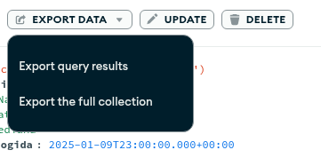

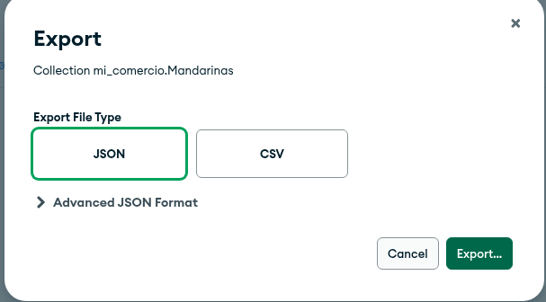

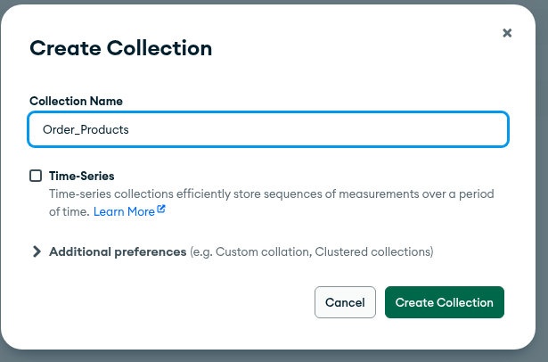

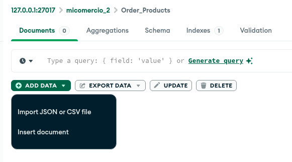

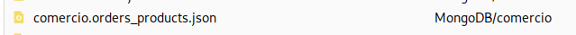

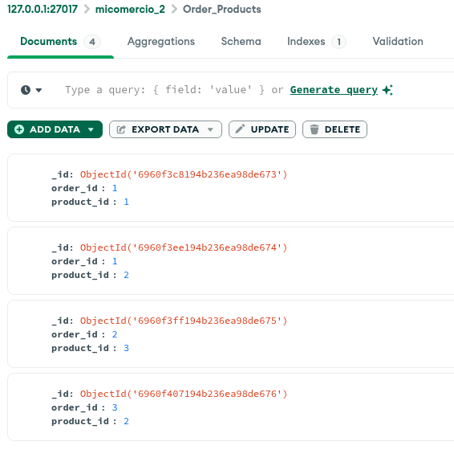

Por otro lado, para el tema de los filtros, existe una terminal en la plataforma, por lo que he utilizado los mismos filtros para hacer las búsquedas

### 0: Lista todas la colecciones

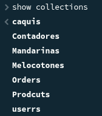

### 1: Listar todos los usuarios

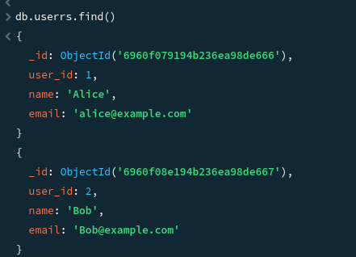

### 2: Buscar pedidos de un usuario cuyo id sea 1

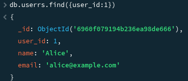

### 3: Listar productos con precio mayor a 30

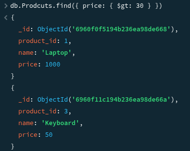

### 4: Buscar pedidos que contengan un producto con id = 2

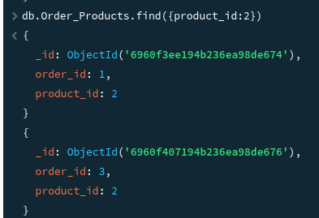

### 5: Obtener usuarios que hayan realizado pedidos con un total mayor a 40

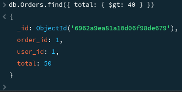

### 6: Mostrar solo los nombres y correos de los usuarios

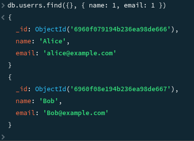

### 7: Contar cuántos productos tienen un precio menor o igual a 50

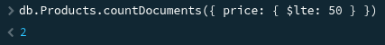

### 8: Encontrar usuarios que hayan pedido un producto llamado "Mouse"

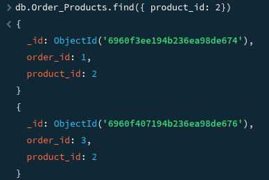

### 9: Agrupar los pedidos por usuario y calcular el total gastado por cada uno

### 10: Listar productos únicos comprados en todos los pedidos

3) Reflexión sobre las diferencias entre trabajar con MongoDB desde la terminal y desde Compass, destacando ventajas y desventajas de cada método.

Después de haber trabajado con ambas opciones, he ahorrado tiempo de la forma gráfica puesto que ya estaban hechas las tablas desde el terminal y sólo he tenido que importarlas. No obstante, después de estar navegando por la aplicación no encontré ninguna otra forma de subir las tablas que no fuera a comando, por lo que en ese aspecto, prefiero el terminal.

Y a la hora de filtrar, también había que hacerlo a comando porque no hay otra forma y tienes que saber los filtros, por lo que en mi opinión no ofrece ninguna ventaja en cuanto al ahorro de tiempo para hacer los filtros.

Mi conclusión final es que no he notado ninguna ventaja a la hora de utilizar el MongoDB Compass con respecto al terminal, por lo que me parece más útil el terminal, no me ha dado problemas y para utilizar el método gráfico, necesitas habilitar el docker, por lo que tienes que usar terminal igualmente.