# 1. Instalación de PostgreSQL en Linux
Actualiza los repositorios del sistema e instala PostgreSQL.

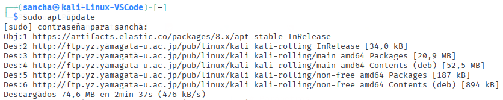

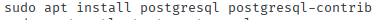

Inicia el daemon de PostgreSQL y verifica el servicio para que se inicie automáticamente cada vez que se arranque el sistema.

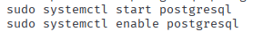

Cambia el usuario postgres y abre la consola de PostgreSQL.

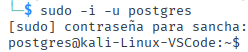

# 2. Creación de la Base de Datos y Tablas
### Paso 1: Crear la base de datos

Conéctate a la consola de PostgreSQL como el usuario postgres.

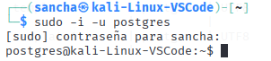

Crea la base de datos llamada EquitacionSuave y conéctate a ella.

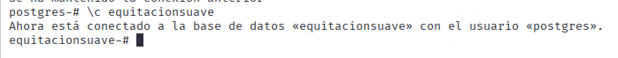


### Paso 2: Crear las tablas principales

Crea una tabla llamada jinetes que incluya los siguientes campos:

id: un identificador único autoincrementado para cada jinete.

nombre: el nombre del jinete.

apellido: el apellido del jinete.

categoría: una cadena que representa el nivel de habilidad (e.g., Avanzado, Intermedio, Principiante).

experiencia_años: un número entero que indica los años de experiencia.

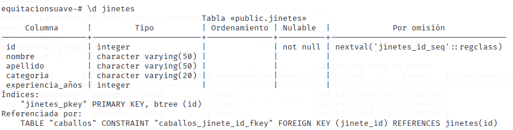

Crea otra tabla llamada caballos que incluya los siguientes campos:

id: un identificador único autoincrementado para cada caballo.

nombre: el nombre del caballo.

raza: la raza del caballo.

edad: un número entero que representa la edad del caballo.

jinete_id: una referencia al id de la tabla jinetes, para indicar quién es el dueño actual del caballo.

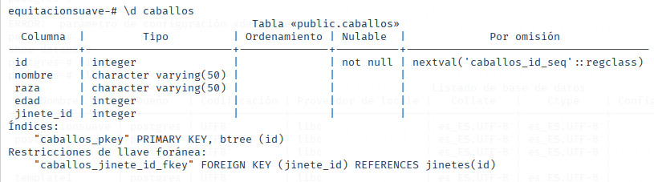


# 3. Gestión de Usuarios y Roles
## Ejercicio 1: Crear usuarios con distintos niveles de permisos
 
Crea un usuario admin_equitacion con permisos para iniciar sesión en PostgreSQL y con la capacidad de crear bases de datos.

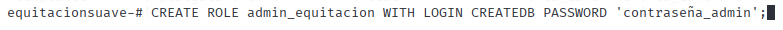

Crea un usuario user_consultas que solo pueda realizar consultas en la base de datos.

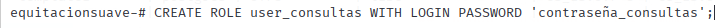

Crea un usuario user_lectura que pueda ver datos en la base de datos pero no modificarlos.

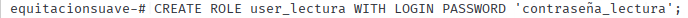

## Ejercicio 2: Asignar permisos

Conéctate a la base de datos EquitacionSuave.

Asigna permisos de consulta (SELECT) a user_consultas sobre las tablas jinetes y caballos.

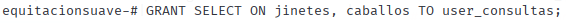 

Configura permisos para user_lectura para que solo pueda ver datos y no modificar/borrar/añadir nada.

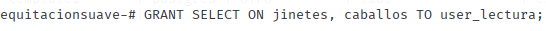

Da permisos completos (SELECT, INSERT, UPDATE, DELETE) al usuario admin_equitacion en las tablas jinetes y caballos.

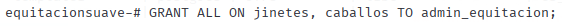

# 4. Inserción de Datos en las Tablas
Inserta varios registros en la tabla jinetes con diferentes valores de nombre, apellido, categoría y experiencia_años.

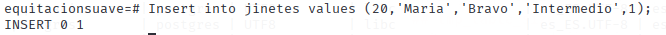 

Inserta varios registros en la tabla caballos, especificando el nombre, raza, edad y el jinete_id correspondiente.

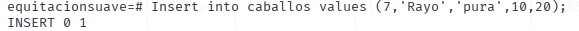

# 5. Consultas de Datos
Realiza una consulta para obtener todos los registros de la tabla jinetes.

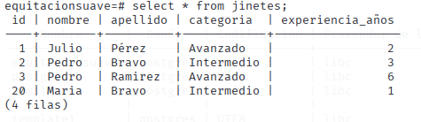

Realiza una consulta que muestre solo los jinetes con más de dos años de experiencia.

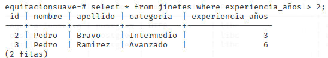

Realiza una consulta para obtener los nombres de los caballos junto con los nombres de sus dueños/jinetes.


# 6. Actualización y Eliminación de Datos
Realiza una actualización en la tabla jinetes para cambiar la categoría de un jinete.


Realiza una eliminación en la tabla jinetes para borrar un registro específico.


# 7. Uso de pgAdmin para Administración Visual

### Paso 1: Acceso a pgAdmin y conexión al servidor PostgreSQL

Abre pgAdmin y conéctate al servidor PostgreSQL usando las credenciales de postgres.

Verifica la conexión y accede a la tabla de bases de datos.

### Paso 2: Crear la base de datos EquitacionSuave

En pgAdmin, crea la base de datos EquitacionSuave con postgres como propietario.

### Paso 3: Crear las tablas jinetes y caballos

Envía la consulta Schema $\rightarrow$ public $\rightarrow$ Tables de pgAdmin, con la tabla jinetes con los campos mencionados en el paso 2.

Crea también la tabla caballos con los campos requeridos y la referencia a la tabla jinetes.

### Paso 4: Insertar y consultar datos

Utiliza la herramienta de consulta (Query Tool) de pgAdmin para insertar y consultar datos en ambas tablas.

### Paso 5: Crear y administrar usuarios y roles en pgAdmin

En Login/Group Roles de pgAdmin, crea los usuarios admin_equitacion, user_consultas y user_lectura.

Asigna los permisos correspondientes a cada usuario en las tablas jinetes y caballos usando la interfaz gráfica de pgAdmin

# 8.II. Características Avanzadas de PostgreSQL
## Ejercicio 1: Uso de JSON en la tabla jinetes
Añade una columna llamada detalles_competencias de tipo JSON en la tabla jinetes.

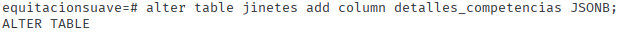

Inserta un nuevo registro en la tabla jinetes y utiliza la columna detalles_competencias para almacenar datos en formato JSON que incluya las competencias y el número de victorias del jinete.

```SQL
iNSERT INTO jinetes (nombre,apellidos,categoria,experiencia_años,detalles_competencias)
values ('Luis','Diaz','avanzado',30, {Salto} Victorias: [10]);
```
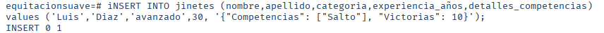

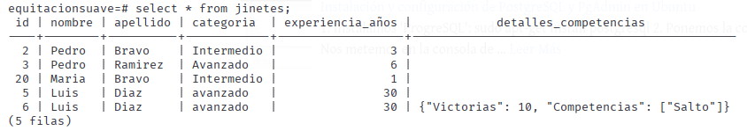

## Ejercicio 2: Uso de arreglos (ARRAYS) para certificaciones
Añade una columna certificaciones de tipo ARRAY en la tabla jinetes.

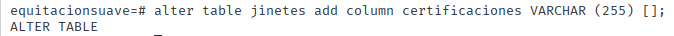

Actualiza uno de los registros en jinetes para almacenar múltiples certificaciones en la columna certificaciones.

```SQL
Update jinetes set certificaciones = ARRAY[ 'Nivel 1', 'Basico'] WHERE NOMBRE = 'Paco';

```

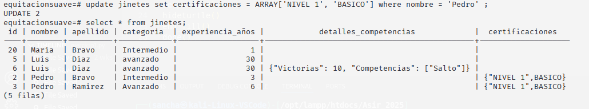

## Ejercicio 3: Creación de Vistas Materializadas
Crea una vista materializada llamada vista_jinetes_avanzados que contenga los registros de jinetes cuya categoría sea Avanzada.

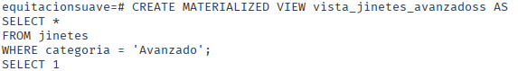

Realiza una operación para actualizar los datos de la vista materializada.
``` SQL
Update  jinetes set NOMBRE = 'julio' WHERE nivel = 'Avanzado';
```

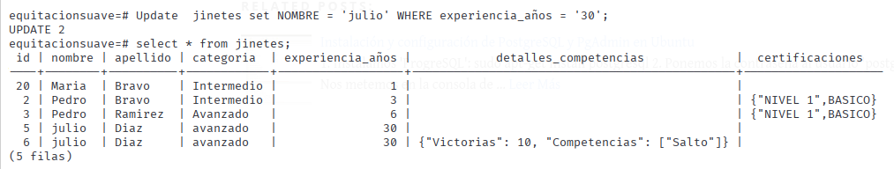

## Ejercicio 4: Herencia en Tablas para gestionar equipos de equitación
Crea una tabla base llamada equipo_base con las columnas id, nombre y tipo.

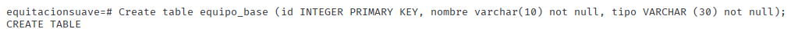

Crea una tabla heredada llamada equipo_de_salto que extienda equipo_base y añada un campo altura_máxima para especificar la altura máxima permitida del equipo.

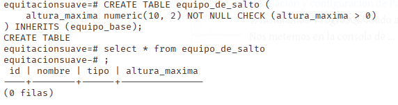

Inserta un registro en la tabla equipo_de_salto.

``` SQL

INSERT INTO equipo_de_salto (id,nombre,tipo,altura_maxima)
values (1,'Marcos','infantil','5');
```
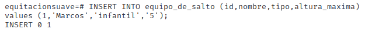