# Redis

## Parte 1: Comandos básicos en Redis

### Claves
1. Establecer y obtener el valor de una clave

SET clave valor
GET clave

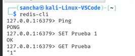

2. Eliminar una clave
DEL clave

Verificar si una clave existe
EXISTS clave

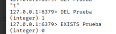

3. Establecer una clave con tiempo de expiración (en segundos)
SETEX clave tiempo valor,obtener el tiempo restante de una clave y renombrar una clave

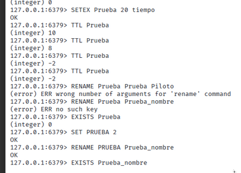

### Listas

 Agregar elementos al principio y al final de una lista, obtener todos los elementos de una lista,obtener y eliminar el primer o último elemento de una lista
y longitud de la lista

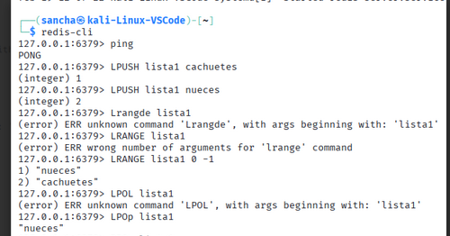

### Conjuntos (Sets)

Agregar elementos a un conjunto, obtener todos los elementos de un conjunto, verificar si un elemento pertenece a un conjunto, eliminar un elemento de un conjunto y operaciones entre conjuntos (intersección, unión, diferencia)

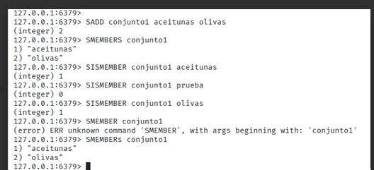

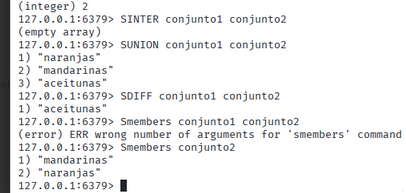

### Hashes

Agregar un campo a un hash, obtener el valor de un campo, obtener todos los campos y valores, verificar si un campo existe y eliminar un campo

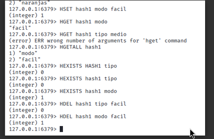

### Administración BBDD

1. Cambiar de base de datos
SELECT número_base_datos

2. Ver claves en la base de datos actual
KEYS *

3. Limpiar todas las claves de la base de datos actual
FLUSHDB

4. Limpiar todas las claves de todas las bases de datos
FLUSHALL

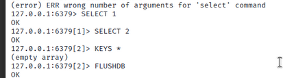

5. Obtener información del servidor
INFO

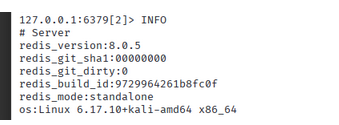

6. Ver estadísticas en tiempo real
MONITOR

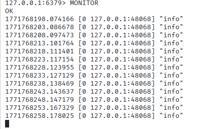

7. Ver configuración actual
CONFIG GET *

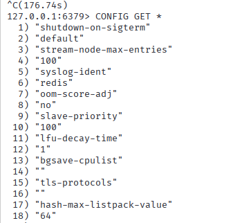

8. Cambiar configuración (temporalmente, mientras Redis esté en ejecución)
CONFIG SET parametro valor

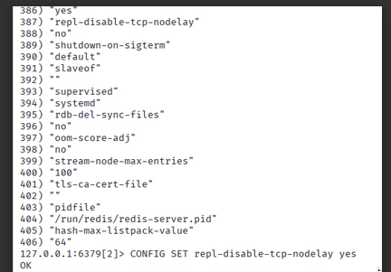

### Copias de seguridad y restauración
Forzar la creación de un snapshot y realizar una copia asincrónica

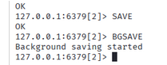

## Parte 2: Uso de un cliente visual

Conectar al servidor Redis (por defecto, host: 127.0.0.1, puerto: 6379).
Explorar Redis desde RedisInsight
Crear claves, insertar datos en listas o hashes, y observar las estructuras visualmente.

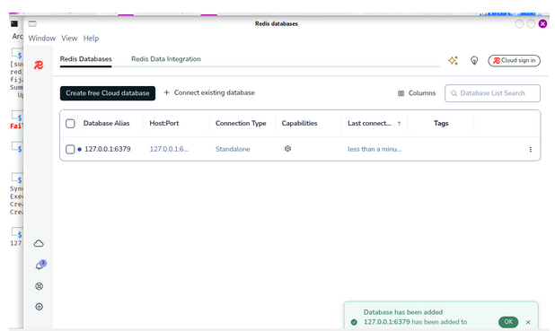

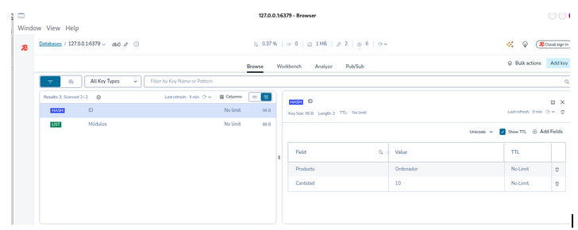

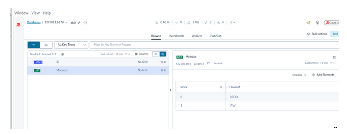

## Parte 3: Otro ejercicio
1. Operaciones
Crear un sistema de gestión de inventario:
- Añade 5 productos (usando hashes con HSET).
- Incrementa el stock de uno de los productos (HINCRBY).
- Elimina un producto.

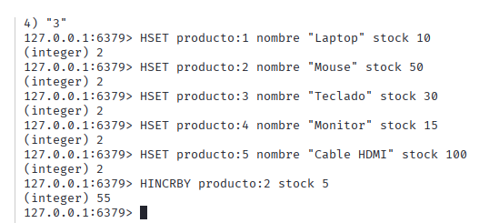

2. Simular un carrito de compras
Crear un carrito con la estructura de listas:
LPUSH carrito "Producto1" "Producto2"
LRANGE carrito 0 -1

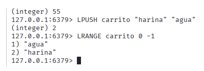

3. Ranking de usuarios
Usar un conjunto ordenado para guardar puntuaciones:
ZADD ranking 100 "usuario1" 200 "usuario2" 150 "usuario3"
ZRANGE ranking 0 -1 WITHSCORES
ZREVRANK ranking "usuario2"

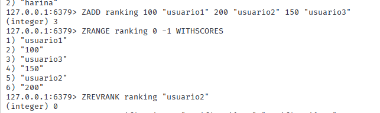

4. Simulación de notificaciones
Usar listas para simular una cola de notificaciones:
LPUSH notificaciones "Notificación 1" "Notificación 2"
RPOP notificaciones

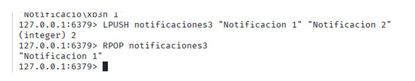

## Parte 4: Otro Ejercicio Más
Diseña un sistema de control de tareas con Redis. Debe permitir:
Añadir tareas con nombre y prioridad.
Consultar todas las tareas en orden de prioridad.
Marcar tareas como completadas (eliminarlas de la lista).
Pistas: Usa listas (LPUSH y LPOP) o conjuntos ordenados (ZADD y ZRANGE).

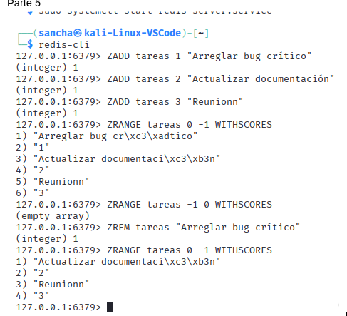
