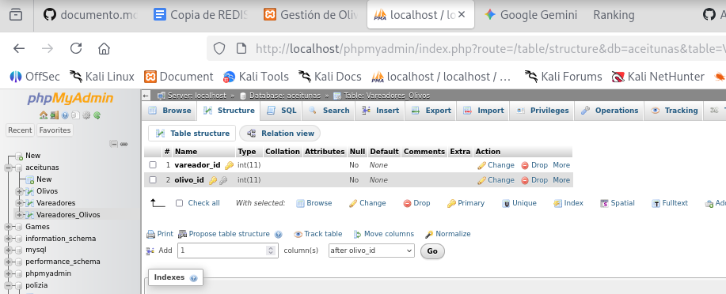
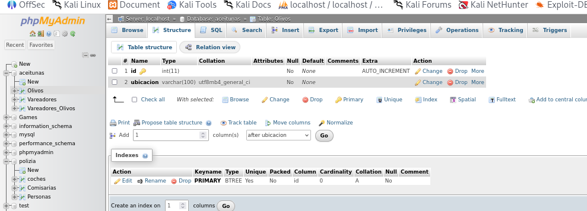
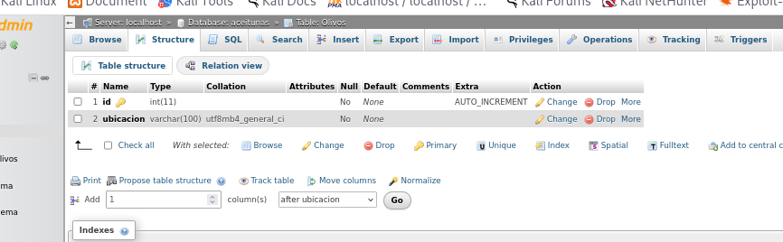
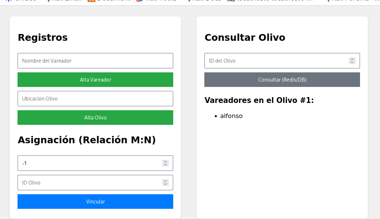

# Redis

## PHP Myadmin

1. Creacion de tablas

### Tabla Vareadores_olivoa

### Tabla olivos

### Tabla vareadores

## Interfaz web

Dede la paǵina se pueden insertar vareadores y olivos, además de que se pueden relacionar ambos e insertar más de un vareador a un olivo.

Y se pueden consultar los datos que se han insertado.

