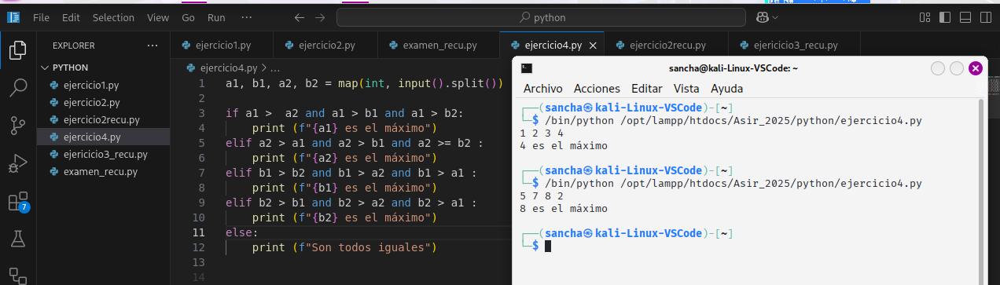
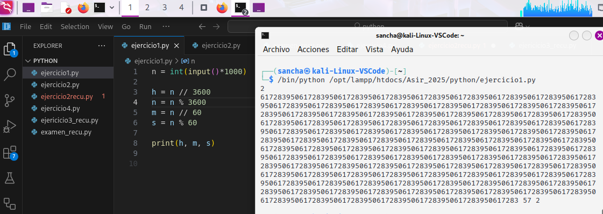
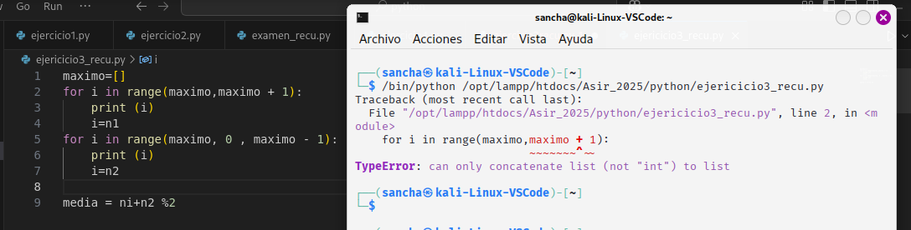

1.Ejercicio de calcular el máximo de 4 números

a1, b1, a2, b2 = map(int, input().split())

if a1 >  a2 and a1 > b1 and a1 > b2:
    print (f"{a1} es el máximo")
elif a2 > a1 and a2 > b1 and a2 >= b2 :
    print (f"{a2} es el máximo")
elif b1 > b2 and b1 > a2 and b1 > a1 :
    print (f"{b1} es el máximo")
elif b2 > b1 and b2 > a2 and b2 > a1 :
    print (f"{b2} es el máximo")
else:
    print (f"Son todos iguales")

2. de un número en milisegundos descomprimir en horas, minutos y segundos

n = int(input()*1000)

h = n // 3600
n = n % 3600
m = n // 60
s = n % 60

print(h, m, s)

Ya me di cuenta al ejecutarlo que tenía qe haberlo dividido

3. de un array sacar el maximo,minimo y media

maximo=[]
for i in range(maximo,maximo + 1):
    print (i)
    i=n1
for i in range(maximo, 0 , maximo - 1):
    print (i)
    i=n2

media = ni+n2 %

