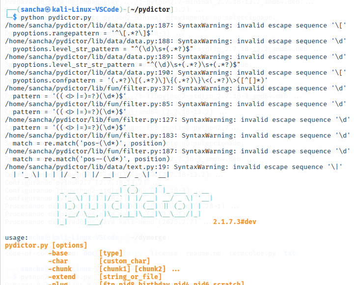
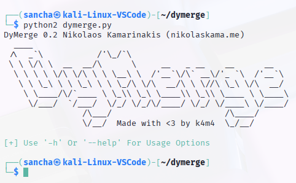
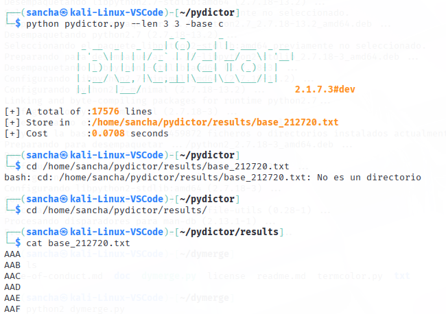
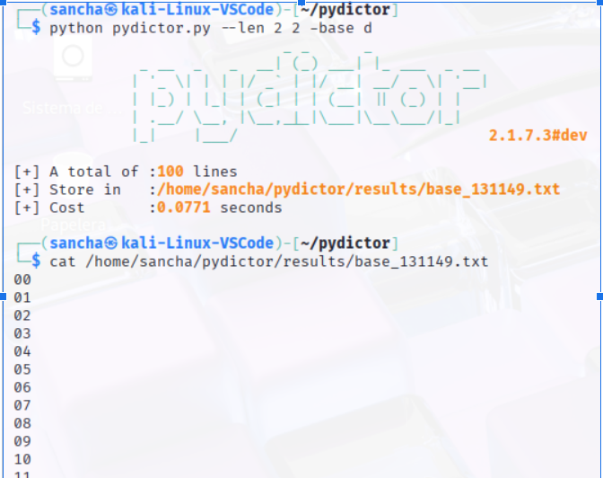
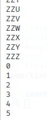
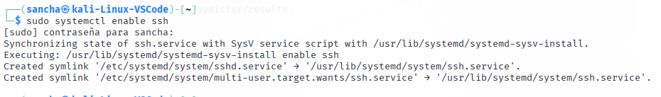
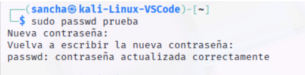
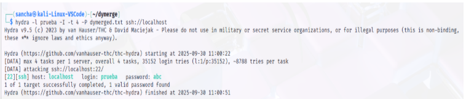

# Simulación de ataque

## 1º Instalaciones 

### Pydictor
En primer lugar, la aplicacion de pydictor al estar subido en un githyb, procedemos a clonarlo

Y una vez descargado lo ejecutamos

### Dymerge

## 2º Creación de Diccionarios
Para ejecutarlos, usamos el siguiente comando:

python pydictor.py --len 3 3 -base c

Se pone python, puesto que es el lenguaje de programación que se utiliza, --len para especificar la longitud de los caracteres
del diccionario, el primer número es el mínimo y el segundo el máximo, por último en funcion del contenido del diccionario, pues
se cambia la base, para las letras mayúsculas c y para números d.
Diccionario de letras

Diccionario de números

### Pydictor

EL primer diccionario se trata de uno formado por letras, formando palabras normales.

Para hacer la fusión de ambos diccionarios, usamos este comando para darle nombre de diccionario

python2 dymerge.py /home/sancha/pydictor/results/base_212720.txt /home/sancha/pydictor/results/base_213402.txt > /home/sancha/pydictor/results/diccionario 

## 3º Ataque con la herramienta hydra en ssh

### Habilitar ssh 

### Nuevo usuario

### Ataque con hydra mediante ssh

## 4º Ataque con Hydra a un servidor web en local

