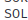

# Simulación de ataque

## 1º Instalacion de pydicto

## 2º Creación de Diccionarios

### Pydictor

EL primer diccionario se trata de uno formado por letras, formando palabras normales.

## 3º Ataque con la herramienta hydra en ssh

## 4º Ataque con Hydra a un servidor web en local

