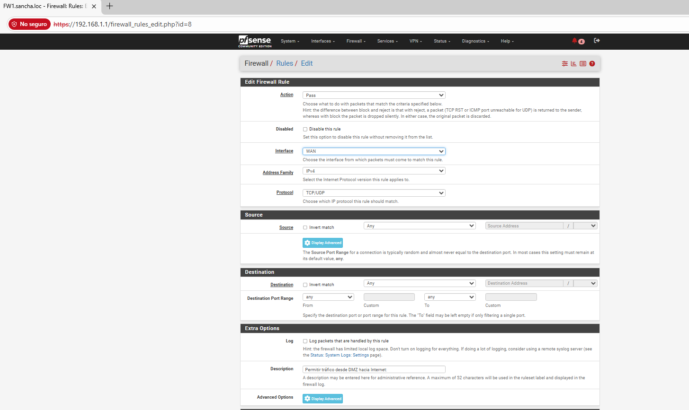
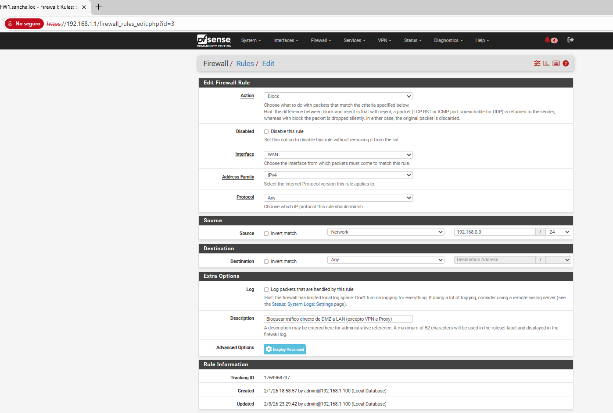
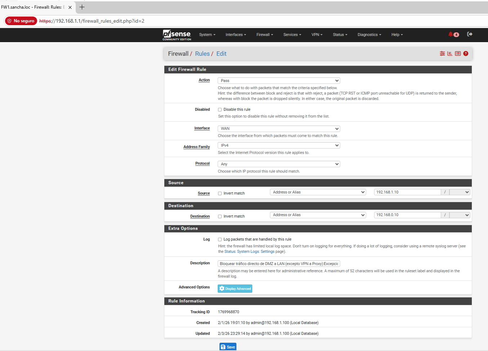
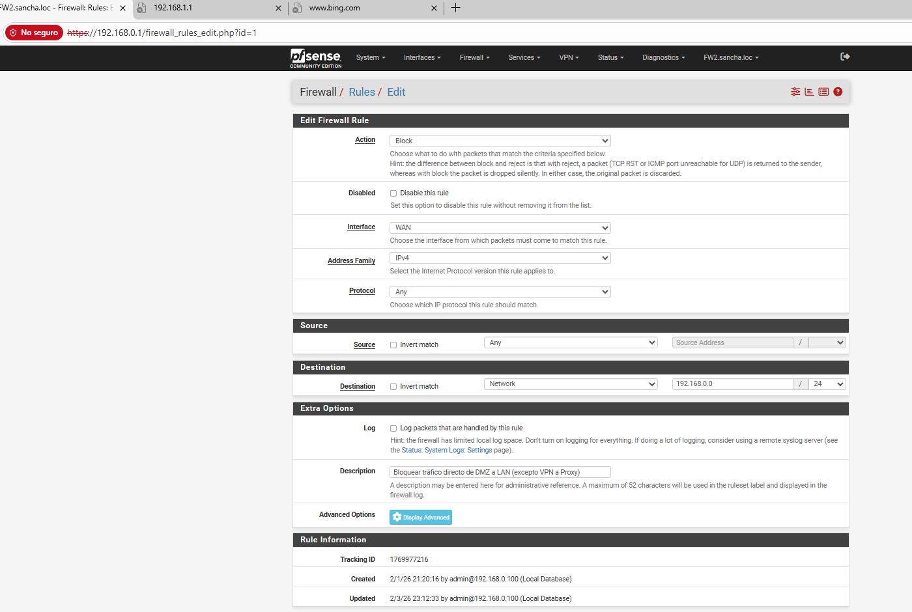
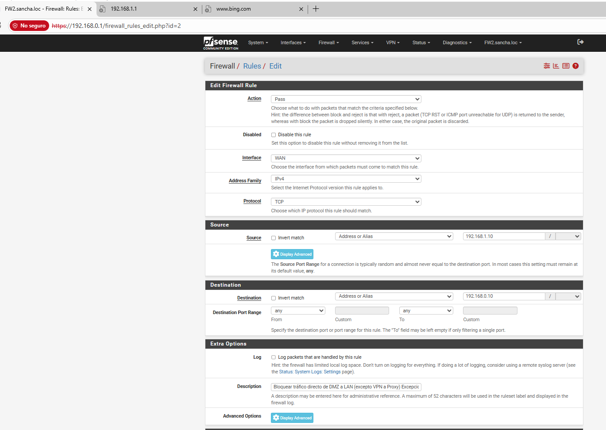
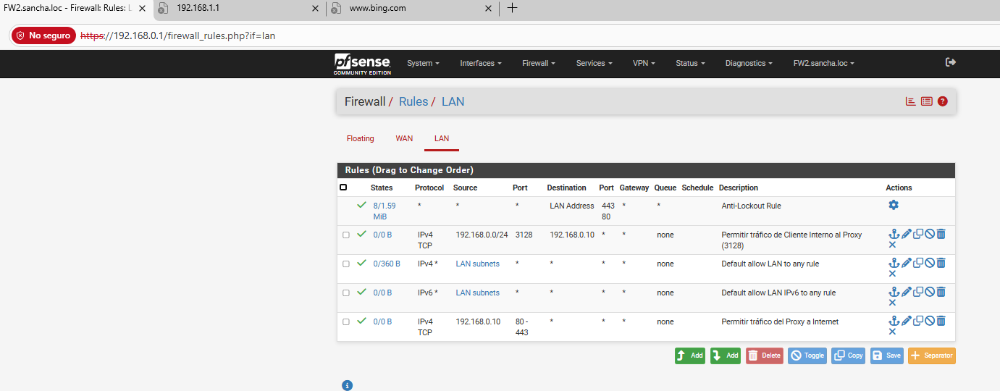
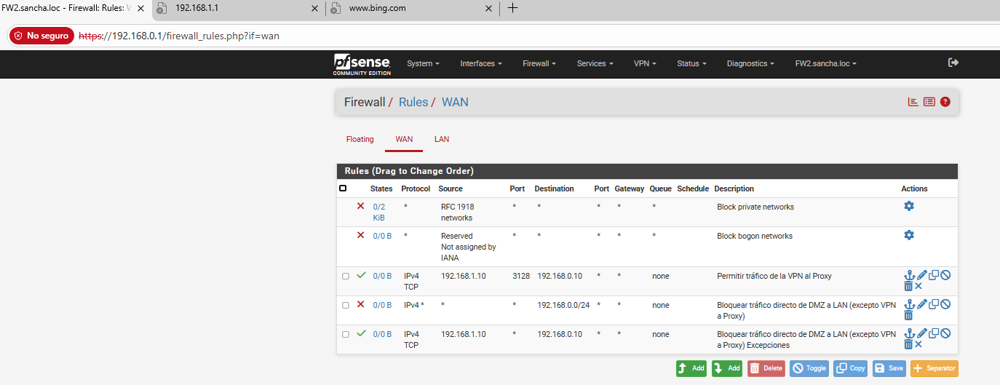
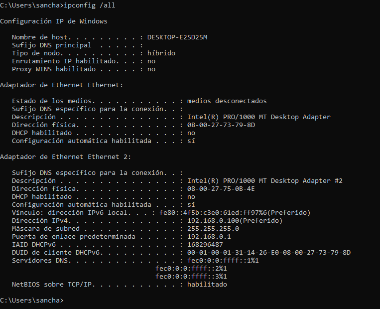
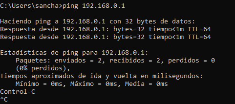

# Desafío 1:

## Configuracion VBOX
### 1. Firewall Externo (FW1 - pfSense)
FW1 (pfSense)

### 2. Firewall Interno (FW2 - pfSense)

## Configuracion interna
### 1. Configuración de Firewalls con pfSense
#### 1.1. Configuración del Firewall Externo (FW1)

Permitir acceso al servidor VPN en la DMZ:
Interfaz: WAN
Proto: UDP
Puerto: 1194
Destino: 192.168.1.10

Permitir tráfico desde DMZ hacia Internet:
Interfaz: DMZ
Proto: TCP/UDP
Puerto: Any
Destino: Any

Bloquear tráfico directo de DMZ a LAN (excepto VPN a Proxy):
Interfaz: DMZ
Proto: Any
Destino: 192.168.0.0/24
Acción: Block

Excepción: 192.168.1.10 -> 192.168.0.10

NAT en FW1
Outbound NAT: Habilita NAT automático o manual.
Regla NAT: Traduce 192.168.1.0/24 → WAN (masquerade).

#### 1.2. Configuración del Firewall Interno (FW2)
Reglas de Firewall (DMZ y LAN)
Permitir tráfico del Proxy a Internet:
Interfaz: LAN
Proto: TCP
Origen: 192.168.0.10
Destino: Any
Puerto: 80, 443

Permitir tráfico de Cliente Interno al Proxy (3128):
Interfaz: LAN
Proto: TCP
Origen: 192.168.0.0/24
Destino: 192.168.0.10
Puerto: 3128
Permitir tráfico de la VPN al Proxy:
Interfaz: DMZ
Proto: TCP
Origen: 192.168.1.10
Destino: 192.168.0.10
Puerto: 3128

Bloquear tráfico directo de DMZ a LAN (excepto VPN a Proxy):
Interfaz: DMZ
Proto: Any
Destino: 192.168.0.0/24
Acción: Block

Excepción: 192.168.1.10 -> 192.168.0.10

Reglas aplicadas a la LAN

Reglas Aplicadas a la DMZ

NAT en FW2
Outbound NAT: Automático.

#### 3. Cliente Interno

Pruebas de conectividad

