Implementar la arquitectura del diagrama en 2 desafíos:
Desafío 1:
Incluye dos firewalls pfSense, red DMZ y un cliente interno. (Para las pruebas se harán todas sin servidor proxy).

Configuración de VirtualBox para cada máquina
1. Firewall Externo (FW1 - pfSense)
Configuración General
Nombre de la máquina: FW1 (pfSense)
RAM: ? GB
CPU: 1 vCPU
Disco duro: ? GB (Dinámicamente asignado)
Sistema operativo: pfSense ISO, FreeBSD 64-bit (descargar ISO de la última versión del sitio oficial).
Configuración de Red
Adaptador 1 (WAN):
Tipo: Red NAT
Propósito: Conexión a Internet.
Adaptador 2 (DMZ):
Tipo: Red Interna
Nombre de la red interna: DMZ
Asegúrate de que la ISO de pfSense esté seleccionada como medio de inicio en la configuración del almacenamiento.

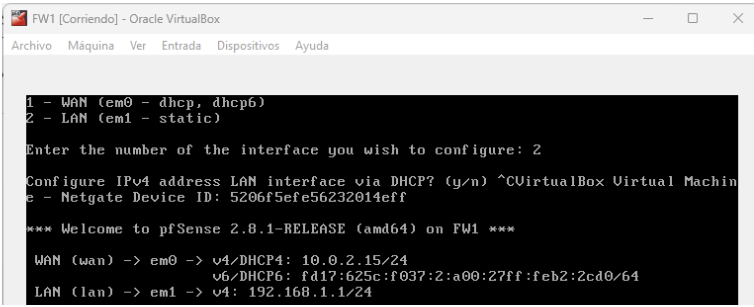

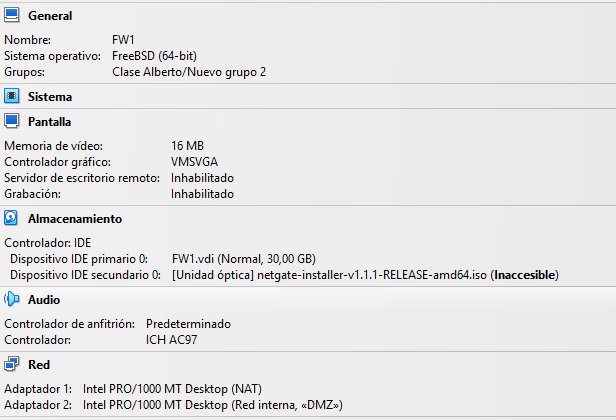

2. Firewall Interno (FW2 - pfSense)
Configuración General
Nombre de la máquina: FW2 (pfSense)
RAM: ? GB
CPU: 1 vCPU
Disco duro: ? GB (Dinámicamente asignado)
Sistema operativo: pfSense ISO, FreeBSD 64-bit (descargar ISO de la última versión del sitio oficial).
Configuración de Red
Adaptador 1 (DMZ):
Tipo: Red Interna
Nombre de la red interna: DMZ
Adaptador 2 (LAN):
Tipo: Red Interna
Nombre de la red interna: LAN

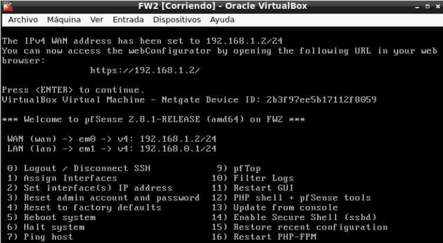

1. Configuración de Firewalls con pfSense
1.1. Configuración del Firewall Externo (FW1)
Reglas de Firewall (WAN y DMZ)
Permitir acceso al servidor VPN en la DMZ:
Interfaz: WAN
Proto: UDP
Puerto: 1194
Destino: 192.168.1.10

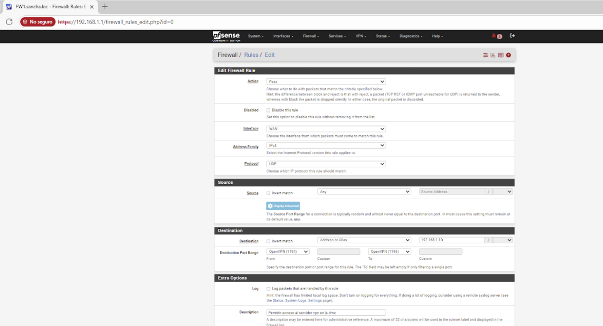

Permitir tráfico desde DMZ hacia Internet:
Interfaz: DMZ
Proto: TCP/UDP
Puerto: Any
Destino: Any

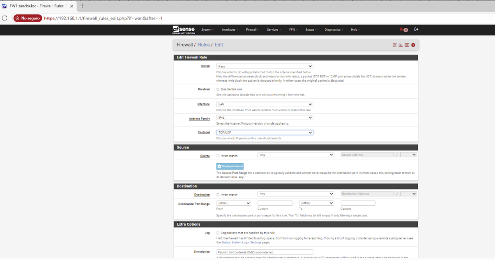

Bloquear tráfico directo de DMZ a LAN (excepto VPN a Proxy):
Interfaz: DMZ
Proto: Any
Destino: 192.168.0.0/24
Acción: Block

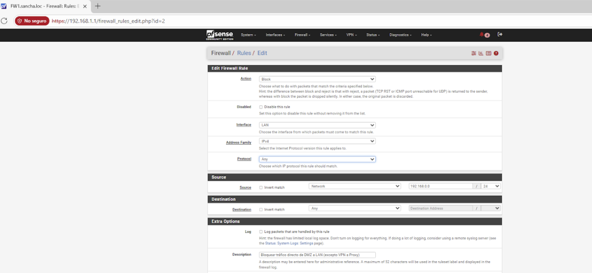

Excepción: 192.168.1.10 -> 192.168.0.10

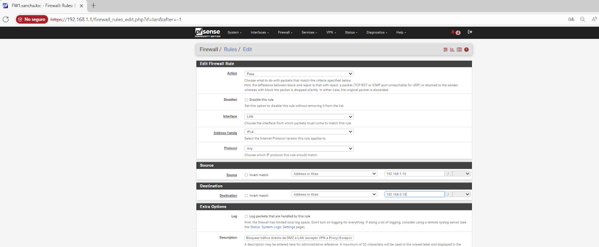

NAT en FW1
Outbound NAT: Habilita NAT automático o manual.
Regla NAT: Traduce 192.168.1.0/24 → WAN (masquerade).

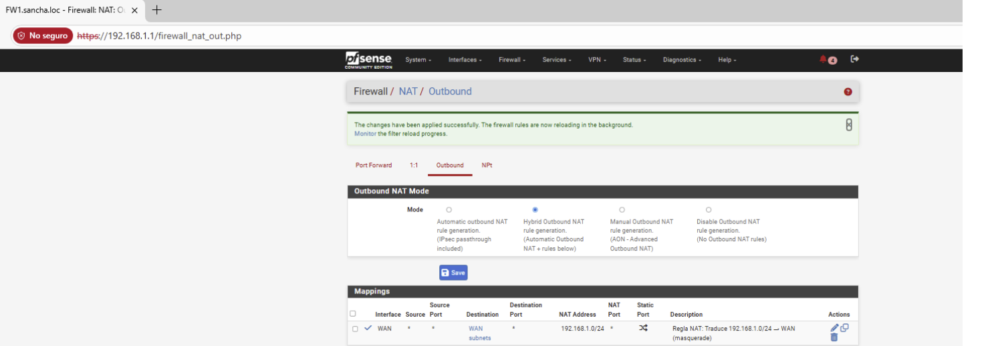

1.2. Configuración del Firewall Interno (FW2)
Reglas de Firewall (DMZ y LAN)
Permitir tráfico del Proxy a Internet:
Interfaz: LAN
Proto: TCP
Origen: 192.168.0.10
Destino: Any
Puerto: 80, 443

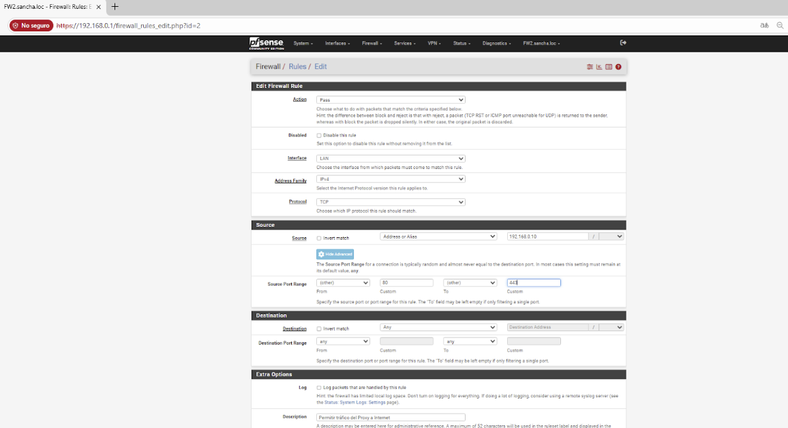

Permitir tráfico de Cliente Interno al Proxy (3128):
Interfaz: LAN
Proto: TCP
Origen: 192.168.0.0/24
Destino: 192.168.0.10
Puerto: 3128
Permitir tráfico de la VPN al Proxy:
Interfaz: DMZ
Proto: TCP
Origen: 192.168.1.10
Destino: 192.168.0.10
Puerto: 3128

Bloquear tráfico directo de DMZ a LAN (excepto VPN a Proxy):
Interfaz: DMZ
Proto: Any
Destino: 192.168.0.0/24
Acción: Block

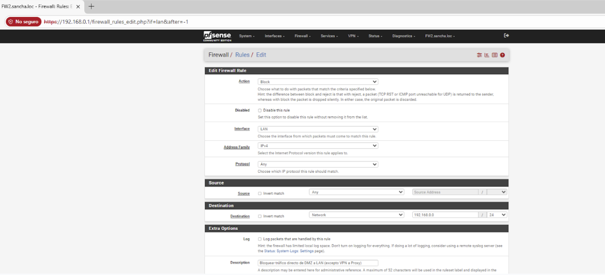

Excepción: 192.168.1.10 -> 192.168.0.10

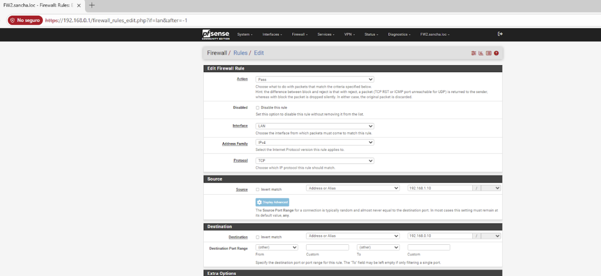

NAT en FW2
Outbound NAT: Automático.

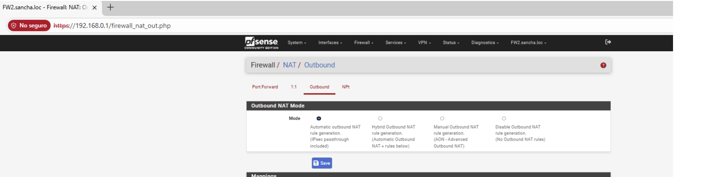

3. Cliente Interno
Configuración General
Nombre de la máquina: Cliente Interno
RAM: ? GB
CPU: 1 vCPU
Disco duro: ? GB (Dinámicamente asignado)
Sistema operativo: Windows 7/10/11.
Configuración de Red
Adaptador 1 (LAN):
Tipo: Red Interna
Nombre de la red interna: LAN

