1. Configuracion firewall

2. Configuracion servidor correo

    - Recepción de correo

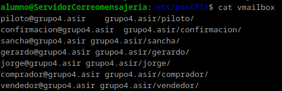

    - Creación de usuarios

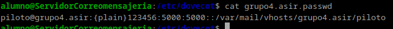

    - Cambios en el archivo main.cf de postfix

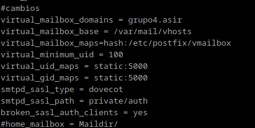

    - Usuario virtual

    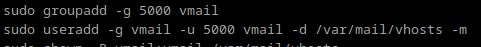

    - Archivo de búsqueda de usuarios

    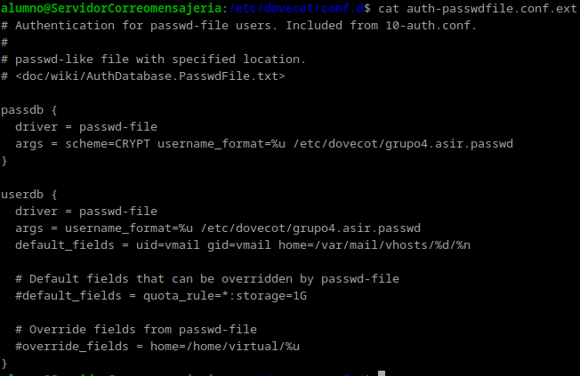

    - Directiva de autenticacion

    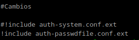
3. Configuracion servidor mensajeria instantaneo
 
Para crear un servicio de chat entre comprador y vendedor, se ha instalado un debian 12 que actúa como servidor y se instaló el servicio prosody. 

Para ello, en el archivo de configuración,se procede a realizar los siguientes ajustes:

    - Establecer el dominio del chat

   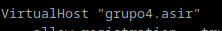

    - Permitir el registro de usuarios

   

    Estos son los usuarios creados que se han creado

   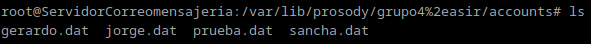

    - Directorio de los certificados

   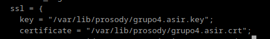

    - Módulos

   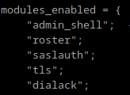

    - Configuración final

   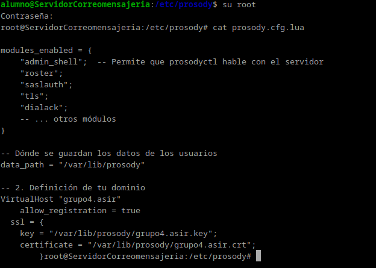