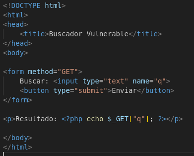
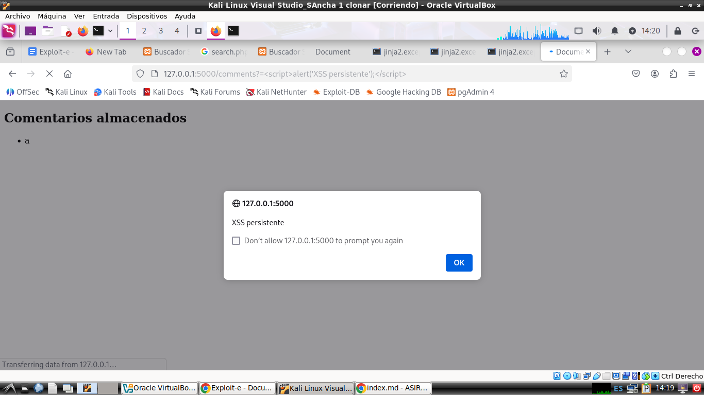

# PRÁCTICA: SEGURIDAD EN APLICACIONES WEB – ASIR 2º

## PARTE A — Inyección SQL (SQL Injection) en Python y Flask

1. SQL

Empezamos creando una base de datos con sqllite3, con los usuarios y contraseñas

Posteriormente creamos el archivo app.py, para ello se utilizan get para obtener los datos y post para que se envíen,además se usa el query
para que se compruebe los usuarios y contraseñas que se introducen y verificar que son los mismos que están en la tabla.

Hemos comprobado que funciona, puesto que recibe las credenciales que escribe y lo compara

A3 corrección de sql

Estos son los cambios en app.py

# PARTE B — XSS Reflejado en PHP

## B1. Desarrollo de aplicación vulnerable

En esta parte, al ejecutar un alert no permite mostrar el contenido de la página.

Se usa GET para enviar el texto ingresado en el campo de nombre q a la URL. Con (<?php echo $_GET["q"]; ?>) toma el valor exacto de ese parámetro q de la URL y lo imprime directamente en la página, si ingresamos esto) en el campo de búsqueda, salta el alert.

## B2. Corrección de la vulnerabilidad

# PARTE C — Implementación de XSS persistente en Flask

