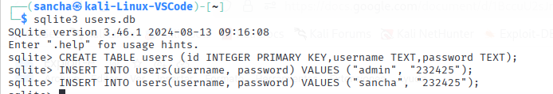
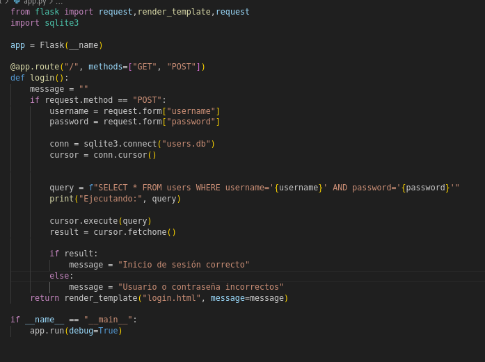
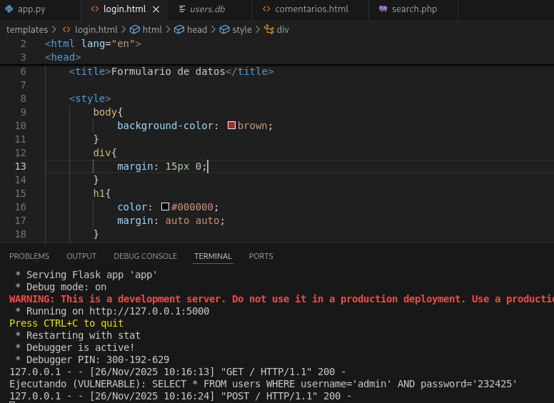
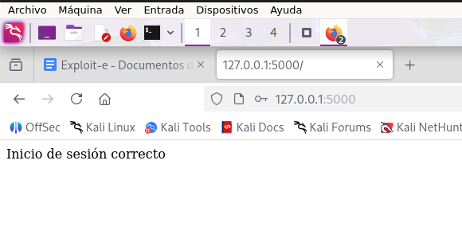
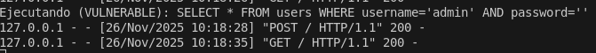
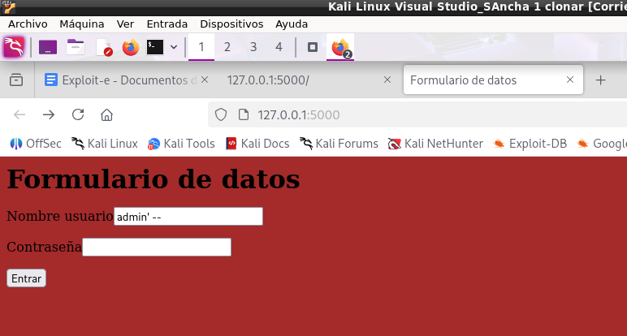
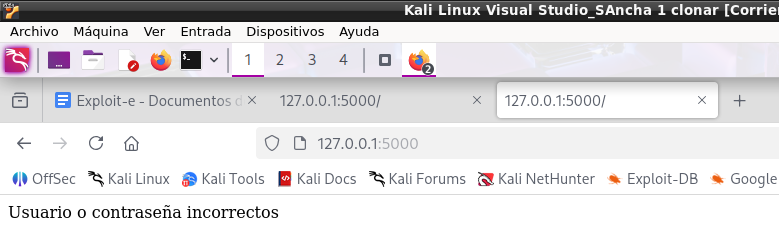
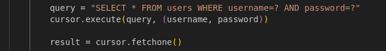
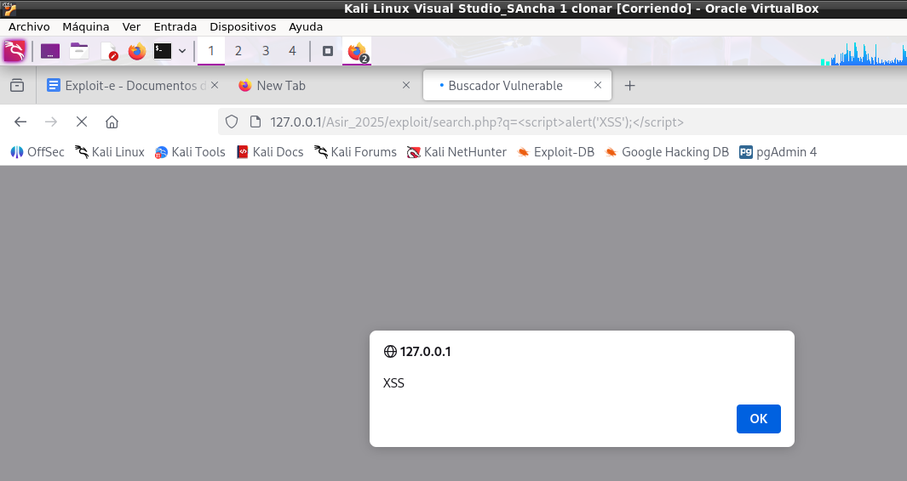
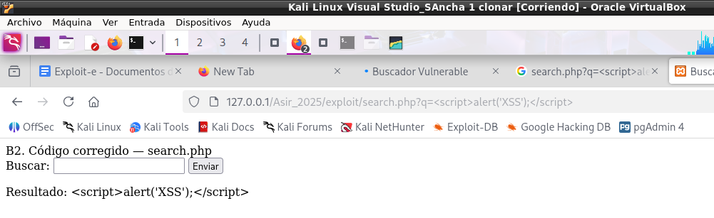

# PRÁCTICA: SEGURIDAD EN APLICACIONES WEB – ASIR 2º

## PARTE A — Inyección SQL (SQL Injection) en Python y Flask

1. SQL

Empezamos creando una base de datos con sqllite3, con los usuarios y contraseñas

Posteriormente creamos el archivo app.py

Hemos comprobado que funciona, puesto que recibe las credenciales que escribe y lo compara

A3 corrección de sql

Estos son los cambios en app.py

