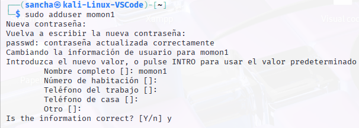
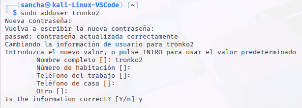
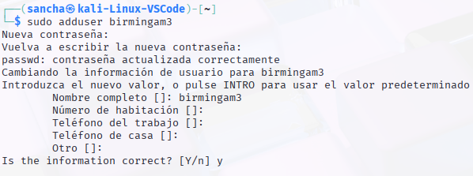
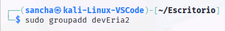
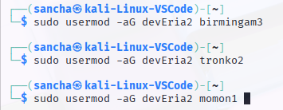
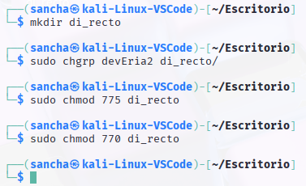
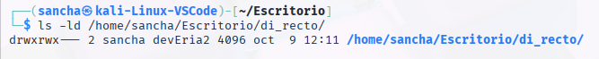
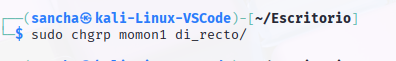
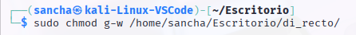
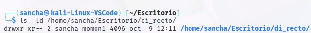

# Ejercicio 1 Gestión de permisos en un entorno de trabajo multiusuario

## Paso 1 Creación Crear un entorno simulado de usuarios y grupos

Creación de grupo

Adhesión al grupo de los usuarios

## Paso 2: Configuración de permisos básicos
Configura los permisos para que solo los usuarios del grupo devEria2 puedan escribir en el directorio:

Verifica mostrando los permisos del directorio:

Propietario (sancha): El usuario sancha es el dueño del directorio y tiene permisos de lectura, escritura y ejecución (rwx).

Grupo (devEria2): El grupo devEria2 es el grupo propietario. Los usuarios que pertenecen a este grupo tienen permisos de lectura, escritura y ejecución (rwx). 

Otros: Cualquier otro usuario que no sea sancha ni pertenezca al grupo devEria2 solo tiene permiso de lectura (r--). No pueden escribir ni acceder al directorio.

## Paso 3: Configuración de permisos avanzados
monon1 debe tener permisos completos (lectura, escritura, ejecución) en todo el proyecto. Cambia el propietario del directorio a monon1:

Los otros dos usuarios del grupo solo deben poder leer y ejecutar archivos, pero no modificarlos. Cambia los permisos de modo que el grupo devEria2 solo tenga permisos de lectura y ejecución:

Preguntas:
¿Qué sucede si un usuario fuera del grupo devEria2 intenta acceder al directorio?

Va a poder acceder y leer el contenido pero no va a poder modificarlo.

¿Qué sucede si tronko2 intenta modificar un archivo dentro del directorio?

Que al quitarle ese permiso, puede modificarlo, pero no va a poder guardar esos cambios.