# Ejercicio 1 Gestión de permisos en un entorno de trabajo multiusuario

### Paso 1 Creación Crear un entorno simulado de usuarios y grupos

Creación de grupo

Adhesión al grupo de los usuarios

### Paso 2: Configuración de permisos básicos
Configura los permisos para que solo los usuarios del grupo devEria2 puedan escribir en el directorio:

Verifica mostrando los permisos del directorio:

Propietario (sancha): El usuario sancha es el dueño del directorio y tiene permisos de lectura, escritura y ejecución (rwx).

Grupo (devEria2): El grupo devEria2 es el grupo propietario. Los usuarios que pertenecen a este grupo tienen permisos de lectura, escritura y ejecución (rwx). 

Otros: Cualquier otro usuario que no sea sancha ni pertenezca al grupo devEria2 solo tiene permiso de lectura (r--). No pueden escribir ni acceder al directorio.

### Paso 3: Configuración de permisos avanzados
monon1 debe tener permisos completos (lectura, escritura, ejecución) en todo el proyecto. Cambia el propietario del directorio a monon1:

Los otros dos usuarios del grupo solo deben poder leer y ejecutar archivos, pero no modificarlos. Cambia los permisos de modo que el grupo devEria2 solo tenga permisos de lectura y ejecución:

Preguntas:
¿Qué sucede si un usuario fuera del grupo devEria2 intenta acceder al directorio?

Va a poder acceder y leer el contenido pero no va a poder modificarlo.

¿Qué sucede si tronko2 intenta modificar un archivo dentro del directorio?

Que al quitarle ese permiso, puede modificarlo, pero no va a poder guardar esos cambios.

## Ejercicio 2 Control de Acceso con el Bit SGID en Directorios
Escenario:

El equipo de desarrollo necesita colaborar en un subdirectorio dentro de di_recto. Queremos asegurarnos de que cualquier archivo creado en ese subdirectorio tenga automáticamente el mismo grupo propietario (devEria2), para facilitar la colaboración.

### Paso 1: Crear un subdirectorio para colaboración

Crea un subdirectorio llamado di_afano dentro de di_recto:

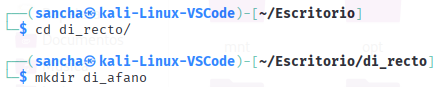

Cambia el grupo propietario del subdirectorio a devEria2:

### Paso 2: Aplicar el bit SGID

Aplica el bit SGID al subdirectorio di_afano, para que todos los archivos creados en él hereden el grupo propietario:

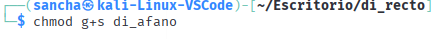

Verifica y muestra los permisos del subdirectorio:

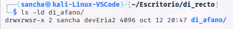

### Paso 3: Crear archivos de prueba

Cambia a tronko2 y crea un archivo llamado archivo_tronko2.txt dentro del subdirectorio di_afano:

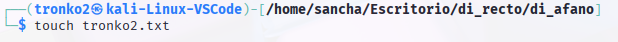

Verifica y muestra los permisos y el grupo propietario del archivo:

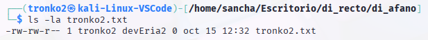

Para poder crear el archivo he tenido que meter al usuario sancha en el grupo, para que formara parte del grupo y el resto
de miembros puedan modificar.

Preguntas:

¿Cuál es el grupo propietario del archivo creado por tronko2?

El propietario es el usuario tronko2

¿Qué ventaja aporta el bit SGID en un entorno de colaboración?

Que permite al resto de usuarios de forma automática tener asignados los permisos de modificar el archivo

## Ejercicio 3: Gestión de Archivos Temporales con Sticky Bit
Escenario:

Se ha creado un directorio temporal compartido entre todos los usuarios del sistema. Necesitas asegurarte de que los usuarios puedan crear y modificar sus propios archivos, pero no puedan eliminar o modificar los archivos de otros usuarios.

### Paso 1: Crear un directorio temporal

Crea un directorio llamado tmp_ran0 en /tmp:

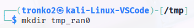

Cambia los permisos para que todos los usuarios puedan leer, escribir y ejecutar en el directorio:

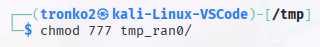

### Paso 2: Aplicar el sticky bit

Aplica el sticky bit al directorio para evitar que los usuarios eliminen archivos de otros:

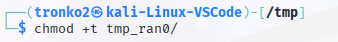

Se ha aplicado para los usuarios que no pertenecen al grupo devEria2 ni son propietarios

Verifica los permisos del directorio:

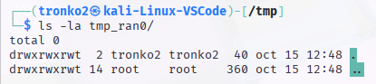

### Paso 3: Crear archivos de prueba

Cambia a monon1 y crea un archivo en el directorio temporal:

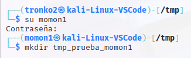

Cambia a birmingan3 y verifica si puede eliminar el archivo de monon1:

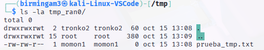

Preguntas:

¿Pudo birmingan3 eliminar el archivo de monon1? ¿Por qué?

No puede borrar el archivo porque los permisos en el directorio, no se han heredado en los archivos que están 
dentro del directorio

¿Cómo ayuda el sticky bit a mejorar la seguridad en directorios compartidos?

Evita que usuarios que no pertenecen al grupo puedan borrar y los miembros del grupo no puedan

## Ejercicio 4: Configuración de umask y Creación de Archivos Nuevos
Escenario:

Quieres configurar el entorno de trabajo para que todos los archivos nuevos creados por los usuarios tengan permisos predeterminados restrictivos (solo lectura y escritura para el propietario, sin acceso para el grupo y otros).

### Paso 1: Configurar umask

Verifica el valor actual de umask:

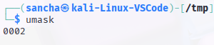
Cambia el valor de umask a 077 para que los archivos creados sean accesibles solo por el propietario:

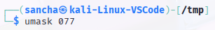
### Paso 2: Crear archivos de prueba

Crea un archivo nuevo llamado gomaesp_umask y verifica sus permisos:

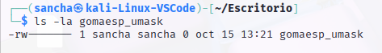

### Paso 3: Restablecer umask

Si deseas restaurar el valor predeterminado de umask, puedes hacerlo:

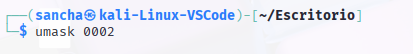

### Preguntas:

#### ¿Cómo afectó el valor de umask a los permisos de los nuevos archivos?

Impedía que el resto de usuarios puedan acceder o modificar el archivo, aunque estén dentro del mismo grupo

#### ¿Cómo podrías usar umask para mejorar la seguridad de los archivos en un sistema multiusuario?

#### Evita que cualquier usario aunque esté dentro de un grupo, pueda modificar archivos personales de otros usuarios.

## Ejercicio 5: Implementación de ACLs
Queremos que birmingan3 pueda leer un archivo específico dentro de un nuevo directorio que se tiene que crear llamado archivos_criticos, pero sin poder modificarlo.

Habilita ACLs en el sistema si no están habilitadas (si ya lo están, omite este paso):

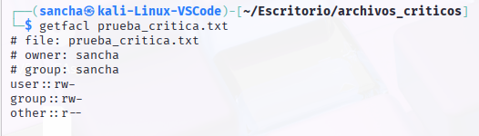

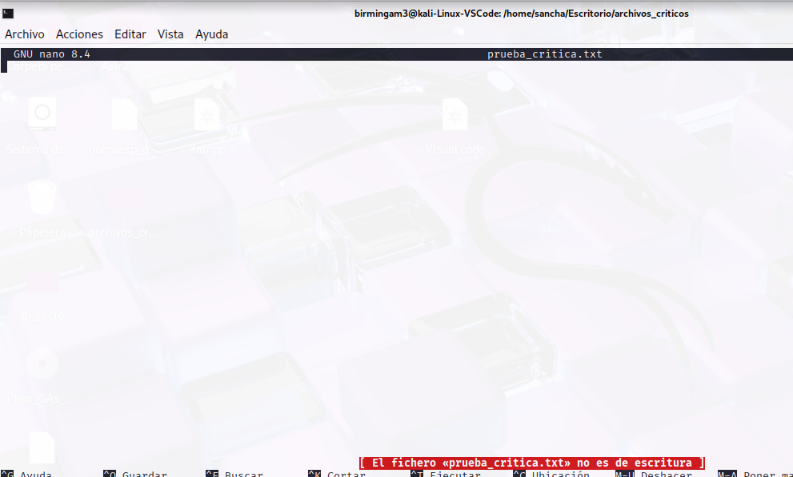

El usuario birmingan3 puede leer el contenido, pero no puede modificarlo.

# Fase 2: Reto de búsquedas avanzadas

Objetivo
Uso efectivo de los comandos de búsqueda (grep, find, locate) y sus opciones para localizar información específica, archivos y directorios dentro del sistema de ficheros.

Setup Inicial a realizar
Se asume que se está en tu directorio personal.
Creación de la Estructura de Ficheros: Crea la siguiente jerarquía de directorios y archivos.

"mkdir -p Documentos/Informes Documentos/Logs Proyectos/Web Proyectos/app"

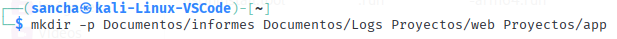

"touch Documentos/Logs/log_acceso.2023 Documentos/Logs/log_error.2024"

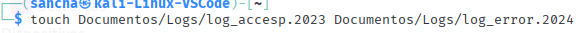

"touch Proyectos/Web/index.html Proyectos/Web/estilos.css"

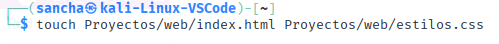

"touch Proyectos/app/main.py Proyectos/app/config_dev.ini"

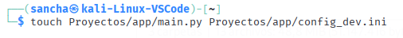

"touch Documentos/Informes/informe_final.txt"

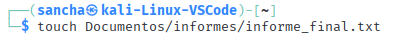

Relleno de Contenido: Utiliza el comando echo o un editor de texto (como nano) para añadir el siguiente contenido a los archivos:

Documentos/Logs/log_error.2024:

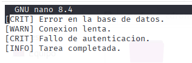

Proyectos/app/main.py:

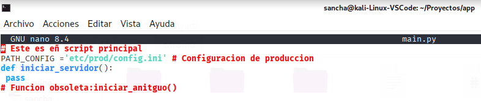

Proyectos/app/config_dev.ini:

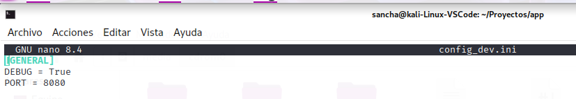

## Ejercicios de Búsqueda

## I. Ejercicios con grep (Búsqueda de Contenido)

Busca Errores Críticos: Muestra todas las líneas que contengan la palabra [CRIT] dentro del archivo Documentos/Logs/log_error.2024.

Busca la Configuración de Producción: Dentro del directorio Proyectos, busca recursivamente (-r) en todos los archivos la cadena PATH_CONFIG.

Contar Fallos: Muestra solo el número de líneas (-c) que contienen la palabra Fallo en log_error.2024.

Líneas sin Comentarios: Muestra todas las líneas del archivo Proyectos/app/main.py que NO (-v) comiencen con el símbolo de comentario (#).

(Pista: Usa la expresión regular ^# para indicar "empieza por #").

## II. Ejercicios con find (Búsqueda de Archivos por Propiedad)

Archivos de Configuración: Busca todos los archivos que terminen con la extensión .ini en todo el directorio de la práctica.

Directorios Específicos: Busca todos los elementos que sean directorios (-type d) y se llamen Logs.

Archivos Grandes (Simulación): Ejecuta truncate -s 2M Documentos/Informes/informe_final.txt. Ahora, busca todos los archivos (-type f) dentro de la práctica que sean mayores a 1 Megabyte (-size +1M).

Archivos Modificados Recientemente: Busca todos los archivos (-type f) que hayan sido modificados (-mtime) en el último día (-1).

## III. Ejercicios con locate (Búsqueda Rápida en Base de Datos)
Nota: Si el comando locate no encuentra los archivos recién creados, se debe ejecutar sudo updatedb primero si tiene permisos.

Búsqueda General: Busca rápidamente la ruta completa de todos los archivos que contienen la palabra config en su nombre.

Búsqueda Sin Distinción: Busca el archivo informe_final.txt sin importar si el texto está en mayúsculas o minúsculas (-i).